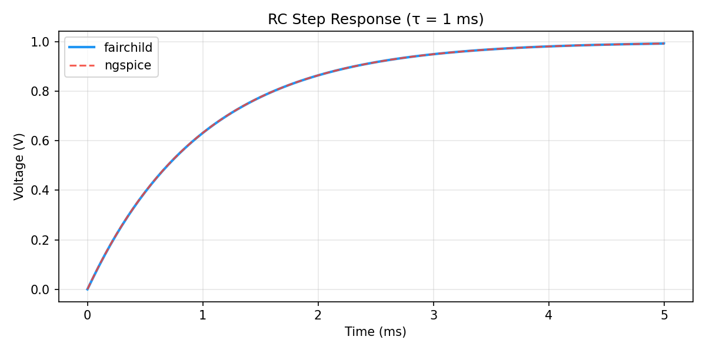
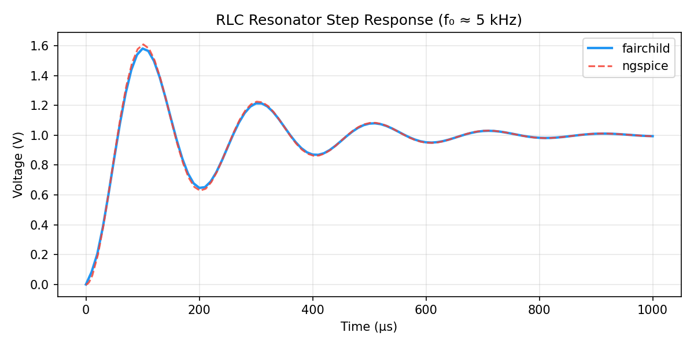
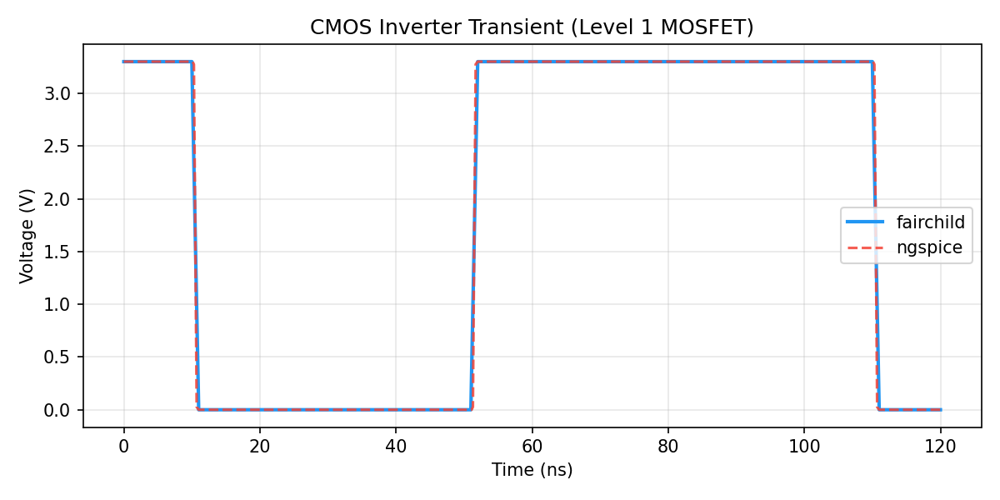

# fairchild

A SPICE-compatible analog circuit simulator written in Rust.

**Status**: Phase 1.5 complete — full transient solver with variable-step control and OSDI reactive Jacobian support.  
**Goal**: First open-source time-domain electro-optic co-simulator (see [PLAN.md](PLAN.md)).

---

## Features

| Category | What's implemented |
|---|---|
| **Elements** | R, L, C, V (DC + PULSE + PWL), I (DC + PULSE + PWL), Diode, MOSFET (Level 1 NMOS/PMOS) |
| **Analyses** | DC operating point (`.op`), transient (`.tran`), small-signal AC (`.ac` or CLI flags) |
| **DC solver** | Newton-Raphson with GMIN stepping + source stepping homotopy |
| **Transient** | Fixed-step Backward Euler / Trapezoidal Rule; variable-step BE+LTE |
| **Device models** | Shockley diode; MOSFET Shichman-Hodges (Level 1) with body effect |
| **OSDI** | Runtime loading of OpenVAF-compiled `.osdi` shared libraries (BSIM4, PSP…) |
| **Output** | CSV (stdout), Nutmeg rawfile (ngspice-compatible) |

---

## Quickstart

### Build

```bash
cargo build --release
```

### Run a simulation

```bash
# DC operating point
./target/release/fairchild -f examples/nmos_dc_sweep.sp

# Transient
./target/release/fairchild -f examples/rc_step.sp

# Nutmeg rawfile output (ngspice-compatible)
./target/release/fairchild -f examples/rc_step.sp --format nutmeg -o rc_step.raw

# AC sweep via .ac directive in netlist
./target/release/fairchild -f examples/rlc_resonator.sp

# AC sweep via CLI flags (overrides netlist)
./target/release/fairchild -f examples/rlc_resonator.sp --ac-start 100 --ac-stop 100k --ac-points 30
```

### Example output (RC step)

```
time,V(in),V(out),I(v1)
0.000000e0,0.000000e0,0.000000e0,0.000000e0
5.000000e-5,1.000000e0,4.876000e-2,-9.512000e-1
...
```

---

## Example Circuits

The `examples/` directory contains ready-to-run SPICE netlists:

| File | Description |
|------|-------------|
| `rc_step.sp` | RC step response (τ = 1 ms) |
| `rlc_resonator.sp` | RLC series resonator (f₀ ≈ 5 kHz) |
| `diode_rectifier.sp` | Half-wave rectifier |
| `cmos_inverter.sp` | CMOS inverter (NMOS + PMOS Level 1) |
| `nmos_dc_sweep.sp` | NMOS resistive-load DC operating point |

### Compare with ngspice

```bash
pip install matplotlib numpy
python examples/compare_ngspice.py --release
# Plots saved to docs/plots/
```

---

## Comparison with ngspice

fairchild results (solid blue) vs ngspice (dashed red) on three example circuits:

**RC Step Response** — 1 kΩ / 1 µF, τ = 1 ms



**RLC Resonator** — series R=10 Ω, L=1 mH, C=1 µF, f₀ ≈ 5 kHz



**CMOS Inverter** — Level 1 NMOS + PMOS (Shichman-Hodges), VDD = 3.3 V



Generate these plots yourself (requires ngspice and matplotlib):

```bash
python3 examples/compare_ngspice.py
```

---

## Validation Against ngspice

All golden tests in `crates/fairchild-core/tests/` compare fairchild against ngspice
automatically when ngspice is on PATH. Tests skip (not fail) when ngspice is absent.

Tolerances: 10 ppm relative / 1 nV absolute for linear circuits; 0.2% for MOSFET Level 1.

```bash
cargo test
```

---

## Benchmark Results

| Circuit | fairchild | ngspice | Speedup | fairchild RSS | ngspice RSS |
| --- | --- | --- | --- | --- | --- |
| RC step (1k/1µF, 5ms tran) | 3.2 ms | 11.2 ms | 3.4× | 2.6 MB | 9.5 MB |
| RLC resonator (1ms tran) | 3.0 ms | 11.4 ms | 3.8× | 9.5 MB | 9.5 MB |
| Diode rectifier (3µs tran) | 3.1 ms | 11.0 ms | 3.5× | 9.5 MB | 9.5 MB |
| CMOS inverter (120ns tran) | 3.0 ms | 10.9 ms | 3.6× | 9.5 MB | 9.5 MB |
| NMOS DC op | 2.7 ms | 11.3 ms | 4.1× | 9.5 MB | 9.8 MB |

---

## Project Structure

```
crates/
  fairchild-core/     # DAE solver, MNA, Newton-Raphson, transient, AC
  fairchild-parser/   # SPICE netlist parser
  fairchild-cli/      # Command-line interface (fairchild binary)
  fairchild-osdi/     # OSDI v0.4 runtime (dlopen, OpenVAF model loading)
examples/             # Ready-to-run SPICE netlists
scripts/              # benchmark.py, compare_ngspice.py
docs/                 # user-guide.md, comparison plots
```

---

## Roadmap

See [PLAN.md](PLAN.md) for the full phased plan.

- **Phase 1.5** ✅ complete: Documentation, CLI, examples, validation, OSDI reactive Jacobian fix.
- **Phase 2** (next): Photonic discipline — first optical circuit (CW laser → waveguide → photodetector).
- **Phase 3**: Python bindings (PyO3).
- **Phase 4**: Differentiable simulation — adjoint-method gradients.

---

## License

MIT
