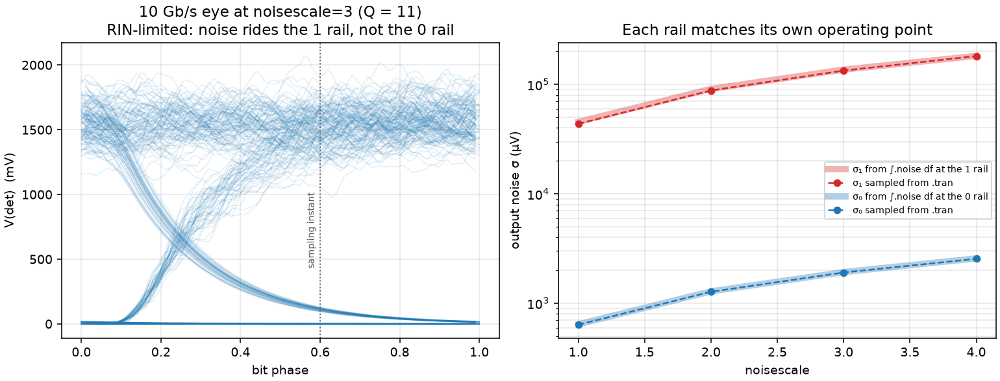
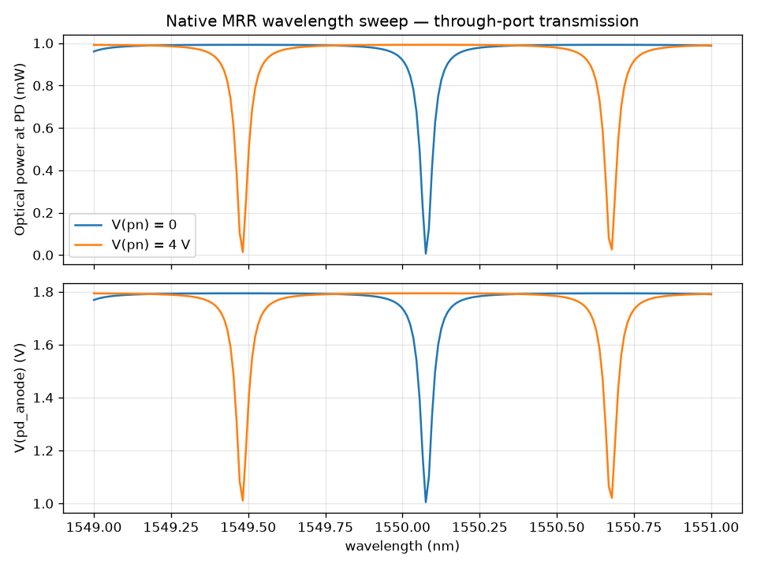
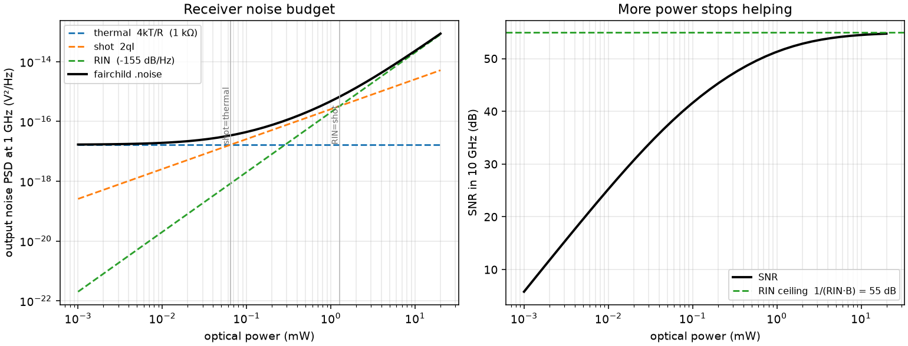
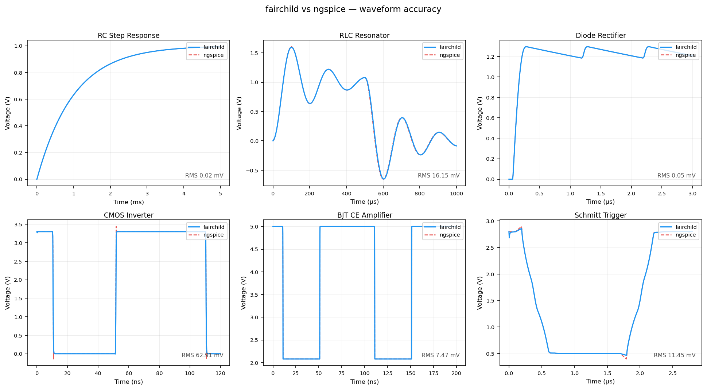
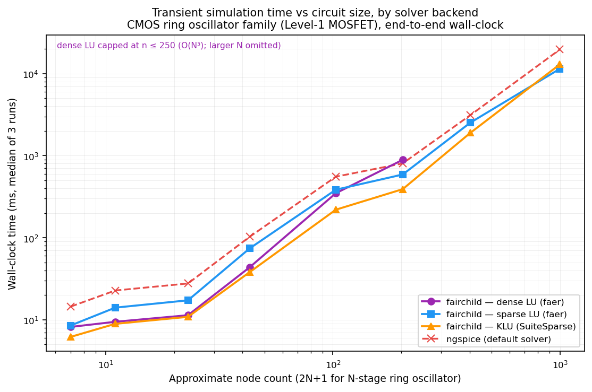

<p align="center">
  <picture>
    <source media="(prefers-color-scheme: dark)" srcset="docs/logos/logo_dark.svg">
    <source media="(prefers-color-scheme: light)" srcset="docs/logos/logo.svg">
    
  </picture>
</p>

<p align="center">
  <strong>A SPICE simulator that solves both electronics and photonics in the same Newton iteration.</strong>
</p>

<p align="center">
  <a href="https://github.com/hughmor/fairchild/actions/workflows/ci.yml"></a>
  <a href="LICENSE"></a>
  
  
</p>

---

fairchild is an MNA engine written in rust.
Optical fields are treated as ordinary MNA unknowns, not handled with a separate solver.
A photodiode's current is available to a TIA in the same timestep, and that amp's output is available to drive an optical modulator.
This is all done inside one convergent solve, with no co-simulation and no fixed-point iteration between two tools.
This means that link budgeting, noise analysis, and circuit optimization can all take place in the same tool.

Most open-source photonic simulators available today are frequency-domain S-matrix, which works to generate spectra, but doesn't support native electro-optic simulation.
Cadence and Synopsys' time-domain electro-optic tools are bloated, outdated, and don't interface with open-source layout workflows.
fairchild aims to be a credible open alternative.

## An example noisy signal chain

```spice
* A directly-modulated 10 Gb/s link, end to end, in one deck.
.optical_port beam
.optical_port far
Vdrv drv 0       PULSE(0 1.8 0 30p 30p 70p 200p)
XLD  beam drv 0  fc_driven_laser slope_w_v=1.5m v_th=0.9 r_in=1e12 rin_db_hz=-155
XWG  beam far    fc_waveguide l_um=2000 alpha_dB_cm=2
XPD  far a 0     fc_photodetector responsivity=0.9
Rl   a 0 1k
Cpd  a 0 10f
.options trannoise=1 variable_step=0
.tran 1p 4n
```

<p align="center">
  
</p>

---

## Install

**CLI**

```bash
cargo build --release
./target/release/fairchild -f examples/electronic/rc_step.sp
```

**Python**

```bash
pip install maturin
maturin develop --release        # from a clone; wheels are not yet on PyPI
```

```python
import fairchild

c = fairchild.Circuit()
c.load("examples/photonic/native_mrr_modulator.sp")
r = c.run("tran", step=5e-9, stop=2e-6, method="gear")

import matplotlib.pyplot as plt
plt.plot(r.time(), r["V(pd_anode)"])
```

**Embedding** — `libfairchild_c` exposes both a batch API and host-driven
transient stepping for mixed-signal co-simulation, where your program owns the
clock. See [`crates/fairchild-c/`](crates/fairchild-c/).

The Rust toolchain is pinned by `rust-toolchain.toml`. Optional: `--features klu`
builds the SuiteSparse KLU backend, which is the fastest on large circuits.

---

## Features

### SPICE

| | |
|---|---|
| **Elements** | R, L, C, K, V, I, D, MOSFET (Level 1), BJT (Gummel-Poon), B (behavioural), E/F/G/H (controlled sources), S/W (switches), T (lossless line), X (subckt / Verilog-A) |
| **Sources** | DC, PULSE, PWL, SIN, EXP, SFFM, AM, `AC <mag> [phase]` |
| **Analyses** | `.op`, `.dc`, `.tran`, `.ac`, `.noise` |
| **Integration** | Backward Euler, trapezoidal, GEAR (BDF-2); fixed or LTE-controlled step |
| **Solvers** | dense LU, sparse LU (faer), KLU; Armijo-damped Newton with `pnjlim`/`fetlim`, source and gmin homotopy |
| **Directives** | `.options`, `.ic`, `.nodeset`, `.measure`, `.lib`, `.include`, `.param`, `.subckt`, `.temp`, `.alter`, `.model`, `.osdi` |
| **Output** | CSV, and ngspice-compatible Nutmeg rawfiles |
| **Verilog-A** | via OSDI v0.4 (OpenVAF-Reloaded) — foundry electrical models, and optical models too |

Not supported: lossy transmission lines, `.disto`, `.pz`, native `.mc`, PSF/FSDB.

Two documents exist because "supported" is not a binary.
[**SPICE support**](docs/spice_support.md) tabulates every ngspice element
letter, dot-command and source function — and, for what is unimplemented,
whether it errors or warns. [**Model status**](docs/model_status.md) gives every
model parameter three columns: parsed, stamped, validated. A parameter that
parses but changes nothing is the failure mode both documents exist to expose.

### Photonics

Native Rust devices on a slowly-varying-envelope `(re, im, λ)` representation.
An optical port is a **bundle**, so a 4-port device is a 4-port symbol rather
than a 12-pin one, and WDM comes from declaring a port `N` channels wide — not
from any per-device opt-in.

| | Devices |
|---|---|
| **Sources** | `fc_cw_laser`, `fc_driven_laser` |
| **Passive** | `fc_waveguide`, `fc_dcoupler`, `fc_splitter`, `fc_grating_coupler`, `fc_optical_2x2`, `fc_facet`, `fc_circulator` |
| **WDM** | `fc_mux`, `fc_demux`, `fc_awgr` (N×N arrayed-waveguide router) |
| **Modulators** | `fc_pn_ps` ×4 tiers, `fc_thermal_ps` ×2, `fc_pn_th_ps` ×4, `fc_mzm`, `fc_phase_shifter_expr` |
| **Detection** | `fc_photodetector` |

Rings, MZIs and filter banks are composed in the netlist from these primitives.
Bidirectional propagation is one option away, and `fc_facet` is what puts light
back on the return path.

<p align="center">
  
</p>

Full reference: [**Photonic models**](docs/photonic-models.md).

### Noise, including the optical terms

A photonic receiver reports the whole direct-detection budget —
`4kT/R_L + 2q·I + RIN·I²` — rather than just its load resistor, so the SNR
saturates at the RIN ceiling instead of improving forever with optical power.

The same generators run in **both** domains: `.noise` reports PSDs, and
`.options trannoise=1` injects them into a transient as random currents, for eye
closure, jitter and BER. One source list feeds both, so the time-domain variance
is the frequency-domain PSD integrated over the resolved band — measured
agreement −0.05 %.

<p align="center">
  
</p>

### Schematic capture

Draw the circuit in KiCad and simulate it live over KiCad's IPC API — no export
step, no file watching:

```console
$ python -i -m fairchild.kicad
>>> print(sch.report())
>>> ckt = sch.circuit(scope="Weight Bank 1")
```

Results annotate back onto the schematic as text or embedded plots. See
[**KiCad integration**](kicad_integration.md).

---

## How accurate, and how fast

Every claim here is reproducible: `python3 benchmarks/plot.py` regenerates both
figures, and [`benchmarks/METHODOLOGY.md`](benchmarks/METHODOLOGY.md) discloses
the comparison rules.



Each panel carries a residual strip, because two curves drawn on top of each
other look identical at 1 mV and at 100 mV alike. Linear circuits match ngspice
to sub-1 mV RMS. The switching circuits' larger RMS is **edge timing, not
offset** — the residual is flat between transitions and spikes at each one,
which is a fixed step resolving a 1 ns edge, and a finer step shrinks it.



Transient wall-clock on CMOS ring oscillators, 3–499 stages, each backend forced
in turn. At 499 stages:

| Backend | Wall-clock | vs ngspice |
|---|---|---|
| fairchild — KLU | 2.96 s | **6.5× faster** |
| fairchild — sparse LU (faer) | 6.38 s | 3.0× faster |
| ngspice (default) | 19.2 s | — |

The MNA matrix is stored sparse, so both sparse backends allocate and factorise
`O(nnz)` rather than `O(n²)`. The largest circuit run to date is a photonic chip
of 18 807 unknowns, whose operating point solves in 0.98 s.

**Testing.** 521 tests. The electrical models are compared against ngspice 46
circuit by circuit — those suites fail loudly in CI rather than skipping if
ngspice is missing. The photonic models are checked against analytic closed
forms and equivalence tests, and *not* against an external simulator; that is
the largest gap in coverage and
[`docs/model_status.md`](docs/model_status.md) marks it per-device.

```bash
cargo test --workspace
```

---

## Documentation

| | |
|---|---|
| [**User guide**](docs/user-guide.md) | Netlist syntax, every element and directive, analyses, CLI, Python, output formats, solver theory, writing your own devices |
| [**Photonic models**](docs/photonic-models.md) | The optical discipline and every `fc_*` device |
| [**SPICE support**](docs/spice_support.md) | What a netlist may contain, and how the rest fails |
| [**Model status**](docs/model_status.md) | Per-parameter contract: parsed vs stamped vs validated |
| [**Benchmarks**](docs/benchmarks.md) | Accuracy and performance against ngspice |
| [**KiCad integration**](kicad_integration.md) | Schematic capture, live IPC, symbol library |

Runnable examples live in [`examples/`](examples): `electronic/` for plain
SPICE, `photonic/` for links, rings, WDM and noise, `verilog_a/` for OSDI
models, `optimization/` for gradient-based design. Most photonic examples take
`--selftest`, which asserts the physics instead of plotting it.

---

## Project layout

```
crates/
  fairchild-core/     Solver: MNA, Newton, transient, AC, noise, photonic devices
  fairchild-parser/   SPICE parser, expression grammar, bundle ports
  fairchild-cli/      The `fairchild` binary
  fairchild-py/       PyO3 bindings
  fairchild-c/        C ABI: batch API + host-driven stepping
  fairchild-osdi/     OSDI v0.4 runtime for Verilog-A models
  fairchild-klu/      SuiteSparse KLU backend (optional feature)
python/fairchild/     Python package: KiCad IPC client, plotting, JAX adapter
examples/             Runnable netlists and scripts
benchmarks/           Comparison circuits and plotting against ngspice
docs/                 Guides and generated figures
scripts/              KiCad transpiler, symbol generator, waveguide extraction
```

---

## Contributing

Contributions are welcome — see [`CONTRIBUTING.md`](CONTRIBUTING.md) for the
build, the test conventions, and the two rules that matter most here: a silent
wrong answer is worse than a crash, and a test is not finished until you have
broken the code and watched it fail.

Bugs and feature requests: [GitHub
issues](https://github.com/hughmor/fairchild/issues).

## Citing

```bibtex
@software{fairchild,
  author  = {Morison, Hugh},
  title   = {fairchild: a time-domain electro-optic circuit simulator},
  url     = {https://github.com/hughmor/fairchild},
  license = {Apache-2.0},
  year    = {2026}
}
```

## License

[Apache License 2.0](LICENSE) — Copyright © 2026 Hugh Morison.
