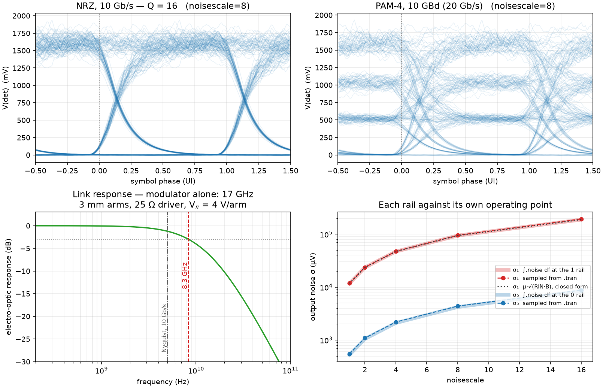

<p align="center">
  <picture>
    <source media="(prefers-color-scheme: dark)" srcset="logos/logo_dark.svg">
    <source media="(prefers-color-scheme: light)" srcset="logos/logo.svg">
    
  </picture>
</p>

# Photonic models

Every device in this document is native Rust, solved in the same Newton
iteration as the transistors beside it. There is no optical solver and no
co-simulation handshake: an optical field is a set of MNA unknowns like any
other, so a photodiode's current is available to a transimpedance amplifier
within the same timestep, and the amplifier's output is available to the
modulator driving the light — inside one convergent solve.

For netlist syntax, analyses, and the CLI, see the
[user guide](user-guide.md). For what each parameter is actually validated
against, see [model status](model_status.md) §9.

## Contents

1. [How light is represented](#1-how-light-is-represented)
2. [Sources](#2-sources)
3. [Passive components](#3-passive-components)
4. [WDM: multiplexing and routing](#4-wdm-multiplexing-and-routing)
5. [Modulators and phase shifters](#5-modulators-and-phase-shifters)
6. [Detection and noise](#6-detection-and-noise)
7. [Extending the discipline](#7-extending-the-discipline)
8. [What is not modelled](#8-what-is-not-modelled)

### Device index

| Device | Card | Section |
|---|---|---|
| CW laser | `fc_cw_laser` | [2](#fc_cw_laser--constant-wave-laser) |
| Directly-modulated laser | `fc_driven_laser` | [2](#fc_driven_laser--voltage-driven-laser-direct-modulation) |
| Waveguide | `fc_waveguide` | [3](#fc_waveguide--lossy-waveguide) |
| 2×2 directional coupler | `fc_dcoupler` | [3](#fc_dcoupler--22-directional-coupler) |
| Y-junction splitter | `fc_splitter` | [3](#fc_splitter--12-y-junction-configurable-loss--asymmetry) |
| Grating coupler | `fc_grating_coupler` | [3](#fc_grating_coupler--fibre--chip-grating-coupler) |
| Behavioural 2×2 block | `fc_optical_2x2` | [3](#fc_optical_2x2--behavioural-per-channel-22-transfer-block) |
| Facet / mirror / terminator | `fc_facet` | [3](#fc_facet--one-port-terminator--partial-reflector--mirror) |
| Circulator | `fc_circulator` | [3](#fc_circulator--3-port-bidirectional-circulator) |
| WDM multiplexer | `fc_mux` | [4](#fc_mux--n--1-wdm-multiplexer) |
| WDM demultiplexer | `fc_demux` | [4](#fc_demux--1--n-wdm-demultiplexer) |
| AWG router | `fc_awgr` | [4](#fc_awgr--nn-arrayed-waveguide-grating-router) |
| PN phase shifter (4 tiers) | `fc_pn_ps`, `_cap`, `_inj`, `_full` | [5](#5-modulators-and-phase-shifters) |
| Thermal phase shifter (2 tiers) | `fc_thermal_ps`, `_rc` | [5](#fc_thermal_ps--thermo-optic-phase-shifter) |
| Combined PN + thermal (4 tiers) | `fc_pn_th_ps`, `_cap`, `_inj`, `_full` | [5](#fc_pn_th_ps--combined-pn--thermal-phase-shifter) |
| Mach-Zehnder modulator | `fc_mzm` | [5](#fc_mzm--idealised-testbench-mach-zehnder-modulator) |
| Expression-driven phase shifter | `fc_phase_shifter_expr` | [5](#declarative-models-no-recompile--fc_phase_shifter_expr) |
| Photodetector | `fc_photodetector` | [6](#fc_photodetector--pin-photodetector) |

---

## 1. How light is represented

### Conventions

Every "optical port" is a **3-wire bundle** `(re, im, λ)`:

- `re`, `im` — slowly-varying-envelope (SVEA) complex amplitude in √W. The
  optical power at the port is `|A|² = V(re)² + V(im)²`. The carrier
  frequency is implicit; only the envelope is solved.
- `λ` — propagation wavelength in metres. A device-local wire that allows
  wavelength-dependent physics (e.g. waveguide propagation phase) without
  forcing a global parameter.

`.optical_port NAME [N]` declares a bundle. **Every photonic device is
bundle-aware**: a single device instance handles all N optical channels.
This is the rule, not an exception — WDM operation comes from connecting
an N-channel `.optical_port` to a device, not from any per-device opt-in.
The parser dispatches per the centralised `BundleArity` table in
`fairchild-parser`:

- **`BundleArity::Aware`** (default for photonics): `fc_waveguide`,
  `fc_splitter`, `fc_dcoupler`, `fc_grating_coupler`, `fc_pn_ps`,
  `fc_thermal_ps`, `fc_photodetector`, `fc_optical_2x2`, `fc_awgr`. The parser
  flattens every bundle
  into its underlying wires and emits ONE X-element with the combined
  terminal vector; the device's `setup_instance` derives the channel
  count from `terminals.len()`. Pure-optical devices run independent
  per-channel propagation. Devices with electrical state (`fc_pn_ps`,
  `fc_thermal_ps`, `fc_photodetector`) keep ONE shared electrical
  interface — anode/cathode, heat_p/heat_n — so the V_pn supply sees
  one PN junction (not N parallel ones), the photodetector sums
  photocurrents into one anode current with one shared dark current
  and shunt, etc.
- **`BundleArity::Bridge`** (`fc_mux`, `fc_demux`): also flattens, but
  also bypasses the channel-count matching check (N-channel bus side
  ↔ N single-channel pins on the other side).
- **`BundleArity::Scalar`**: the laser (`fc_cw_laser`) and every non-
  photonic device. The parser replicates the X-element into N parallel
  instances when bundles are connected. A laser is fundamentally a
  single-wavelength source — to drive a WDM bus, instantiate one laser
  per channel and combine them through `fc_mux`.

Electrical nets and scalar nets (`vmod`, `0`, etc.) wired into a bundle-
aware device are shared across all channels; the device sees one shared
voltage / current per electrical pin. See
`examples/photonic/native_wdm_mrr_modulator.sp` for a full topology.

### Band centre

Photonic devices need a default wavelength for things like the initial
NR iterate (when no laser has yet driven the λ wire) and for any
device parameter that defaults to "the design wavelength". One global
option sets this band-wide default:

```spice
.options lambda_center_nm=1310    * O-band
.options lambda_center_nm=1550    * C-band (default)
.options lambda_center_m=1.31e-6  * same, in metres
```

Or via the CLI: `--opt lambda_center_nm=1310`. Or in Python:
`Circuit.run("op", lambda_center_nm=1310)`.

Devices with their own `wavelength_nm` parameter (the laser's output
wavelength, the PN-PS's reference wavelength) override the band centre
when set explicitly. The waveguide doesn't have a `wavelength_nm`
parameter at all — its λ comes entirely from the input wire and the
band-centre is only a bootstrap fallback.

All values internally are SI. Convenience aliases like `L_um` and
`wavelength_nm` accept the named unit and convert. **Beware SPICE SI
prefixes**: writing `L_um=8u` parses as `L_um = 8e-6` (because `u` =
1e-6 in SPICE), then the device interprets that as `8e-6 µm = 8 pm` —
almost certainly not what you meant. Either drop the suffix (`L_um=8`,
read as 8 µm) or use the SI alias (`L_m=8e-6`, read as 8 µm).

By default the direction of energy flow is fixed by each device's port
topology. A return path is available — see the next section.

### Bidirectional propagation

By default the discipline is unidirectional: each channel carries 3 wires
(`re`, `im`, `λ`) and light flows in the direction each device's port topology
implies. That is the right default — it halves the unknown count, and most
links genuinely are one-way.

Turn on the return path with

```spice
.options enable_bidirectional=1
```

(or `bidirectional=1`, `--opt enable_bidirectional=1`, or the Python kwarg).
Each channel then carries 5 wires and every bundle-aware device stamps an
independent forward and backward path. The λ wire is shared between the two
directions — it is a label on the channel, not a property of a direction.

| Direction | Wires |
|---|---|
| Unidirectional (default) | `<port>_re_<k>`, `<port>_im_<k>`, `<port>_wl_<k>` |
| Bidirectional | `<port>_re_fw_<k>`, `<port>_im_fw_<k>`, `<port>_re_bw_<k>`, `<port>_im_bw_<k>`, `<port>_wl_<k>` |

**What puts light on the return path.** Two devices do: `fc_facet`, which
reflects a specified fraction of what arrives at a one-port end cap, and
`fc_circulator`, which routes it. Everything else propagates the backward field
without generating it — a waveguide attenuates and phase-shifts light travelling
back through it exactly as it does light travelling forward, but does not
scatter one into the other. So a chain terminated by a mirror gives you round
trip loss, round trip phase, and return loss at the launch port, and gives you
those exactly; distributed backscatter and intra-device forward↔backward
coupling are not represented.

**A wire nobody drives reads exactly zero.** Not "nearly zero" — a node no
element stamps into is pinned at `V = 0` outright rather than floated on `gmin`,
so an unconnected optical port stays at a hard zero through a whole transient.
That matters more than it sounds: `gmin` is twelve orders below the couplings a
device writes into such a node's column when it *reads* the node without
conducting to it, so the factorisation used to hand back roundoff amplified by
`1/gmin`. Invisible while the wire is lit; the entire signal once it is dark,
and enough to stop Newton converging at any timestep.

**Who is allowed to drive a backward wire.** Exactly one device may, and the
simulator now enforces it: two devices pinning the same wire is a hard error
naming both elements and the wire. That check exists because the failure was
otherwise silent — a rank-deficient optical block does not make LU fail, it
makes it return a `gmin`-weighted average of the two assertions. The error also
fires on forward wires and on non-optical potentials; it is a property of the
matrix, not of the discipline.

**Which wire each device owns.** Every optical port plays one of two roles, and
the role fixes who drives what:

| Role | Drives | Reads |
|---|---|---|
| `in` (light enters here) | `re_bw`, `im_bw` | `re_fw`, `im_fw`, `wl` |
| `out` (light leaves here) | `re_fw`, `im_fw`, `wl` | `re_bw`, `im_bw` |

Wiring an `in` port onto another `in` port — or an `out` onto an `out` — is the
mistake this catches. The full accounting, which is an audit rather than a
design statement, because each of these was checked one device at a time:

| Device | Ports | Notes |
|---|---|---|
| `fc_waveguide`, `fc_pn_ps`, `fc_thermal_ps`, `fc_pn_th_ps`, `fc_mzm`, `fc_grating_coupler` | `in`, `out` | The shared `OpticalSegment`; both directions pay the same loss and phase. |
| `fc_splitter` | `in`, `out`×2 | Backward fields from both outputs recombine into the input. |
| `fc_dcoupler` | `in`×2, `out`×2 | Same coupling matrix each way; only the outputs carry a λ tag. |
| `fc_mux` | bus `out`, channels `in` | Backward light on the bus leaves through the channel port of its own slot. |
| `fc_demux` | bus `in`, channels `out` | Backward light at a channel port returns into that slot of the bus. |
| `fc_circulator` | port 1 `in`, ports 2–3 `out` | See [`fc_circulator`](#fc_circulator--3-port-bidirectional-circulator). |
| `fc_facet` | one `in` | The only device that turns forward light into backward light. |
| `fc_cw_laser`, `fc_driven_laser` | `out` (fields and λ only) | Absorbs what comes back; does **not** assert the wire is dark. |
| `fc_photodetector` | `in`, reads only | Owns no optical wire at all. Both directions land in one photocurrent. |
| `fc_awgr`, `fc_optical_2x2` | — | Refuse `enable_bidirectional=1` outright; the backward fields would need their own routing. |

Two of these were wrong until the audit and are worth naming, because the
symptom in both cases was missing power rather than a diagnostic. `fc_mux` and
`fc_demux` stamped their backward pair in the forward direction, so a
reflection anywhere past one read as zero at every channel port. And
`fc_circulator` used a port-relative convention in which every port behaved
like an `in` port, so it could not be wired into a chain at all — which is the
one thing a circulator is for.

### One physical device, all the modes

A bundle-aware device such as `fc_pn_ps` is ONE physical junction interacting
with N optical channels, not N devices. Shared physics integrates across every
mode, and the stamps enforce it:

- One `V_pn` drives one current. N channels do **not** create N parallel
  conductances.
- A photodetector sums photocurrents from every channel into one anode current,
  over one shared dark current and one shared shunt.
- Where a device carries thermal state, the heat is the sum of absorbed power
  across all channels and directions, and the resulting `Δn` applies to all of
  them.

This is a consequence of the representation rather than something to be aware
of while writing a netlist — but it is why you cannot model two independent
modulators by giving one device a 2-channel port.

---

## 2. Sources

### `fc_cw_laser` — constant-wave laser

```
X<name>  out  fc_cw_laser  [param=val …]
```

| Port | Role |
|---|---|
| `out` | bundle, optical output |

| Parameter | Default | Description |
|---|---|---|
| `power_mW` | 1.0 | Output optical power. Sets `re² + im² = power_mW × 1e−3`. |
| `power_W` | — | Alternative spelling; overrides `power_mW`. |
| `phase_deg` | 0 | Initial phase of the SVEA carrier. |
| `wavelength_nm` | 1550 | Output wavelength (drives the `λ` wire). |
| `re_amp` / `im_amp` | derived | Direct override of the SVEA components. |
| `rin_db_hz` | unset | Relative intensity noise, dB/Hz (e.g. `-155`). Unset = noiseless; `.noise` only. |

`power_mW`, `power_W`, and `phase_deg` are not orthogonal: `power_*` set
the magnitude of `(re, im)` while preserving phase; `phase_deg` rotates the
current magnitude. Setting `re_amp` / `im_amp` directly bypasses both.

**Physics.** Three direct-potential equations fix `V(out_re) = √P · cos(φ₀)`,
`V(out_im) = √P · sin(φ₀)`, `V(out_λ) = λ`. No electrical input and no spectral
linewidth. `rin_db_hz` adds intensity noise — see
[Optical noise](#optical-noise) — and reaches `.tran` only under
`.options trannoise=1`; it never affects `.op`, `.dc` or `.ac`.

### `fc_driven_laser` — voltage-driven laser (direct modulation)

```
X<name>  out  p  n  fc_driven_laser  [param=val …]
```

| Port | Role |
|---|---|
| `out` | bundle, optical output (one channel) |
| `p`, `n` | electrical drive |

| Parameter | Default | Description |
|---|---|---|
| `slope_w_v` / `slope` | 1e−3 | dP/dV above threshold, W/V. `slope_mw_v` for mW/V. |
| `v_th` | 0 | Lasing threshold, V. |
| `p_floor_w` | 1e−12 | Below-threshold output floor, W (−90 dBm). |
| `r_in` | 1e6 | Input resistance across (`p`, `n`), Ω. |
| `phi_0_deg`, `wavelength_nm`, `rin_db_hz` | as `fc_cw_laser` | |

```
P(V) = p_floor_w + max(0, slope_w_v · (V(p) − V(n) − v_th))
```

The L–I curve of a diode laser written against voltage: a hard threshold and a
straight line above it. One SPICE source now produces a modulated optical
waveform with no `fc_mzm` in the deck — `Vd drv 0 PULSE(0 2 0 10p 10p 490p 1n)`
is a 1 Gb/s directly-modulated transmitter. Drive it from a current source
instead by working in `I · r_in`; `slope_w_v · r_in` is then the slope
efficiency in W/A.

**`p_floor_w` is load-bearing.** The wires carry `A = √P`, so
`dA/dV = slope/(2√P)` diverges as `P → 0` — a laser switched hard off would
hand Newton an unbounded Jacobian entry on every falling edge. The floor caps
it and doubles as the spontaneous-emission background a real laser has anyway.
At the default it is 90 dB below a 1 mW output, far under any extinction ratio
worth quoting.

The drive derivative is stamped exactly rather than frozen at the previous
iterate, so an opto-electronic feedback loop (laser → detector → back to the
drive node) converges as Newton rather than as successive substitution, and
sensitivities reach through the laser.

No chirp: direct modulation shifts the emission wavelength with carrier
density, and λ here is a static tag on a wire.


---

## 3. Passive components

### `fc_waveguide` — lossy waveguide

```
X<name>  in  out  fc_waveguide  [param=val …]
```

| Port | Role |
|---|---|
| `in`  | bundle, optical input |
| `out` | bundle, optical output |

| Parameter | Default | Description |
|---|---|---|
| `L_um` | 100 | Length, µm. |
| `L_m` / `length` | — | Length, m (overrides `L_um`). |
| `n_eff` | 2.445 | Effective index at `wl_ref_nm` (sets the accumulated phase per unit length). |
| `n_g` | 4.2 | Group index at `wl_ref_nm` (sets the dispersion slope dn_eff/dλ). |
| `wl_ref_nm` | 1550 | Reference wavelength at which `n_eff` and `n_g` are quoted. Alias: `wl_ref_m` in metres. Defaults from `.options lambda_center_nm`. |
| `alpha_dB_cm` | 2.0 | Power loss (dB/cm). |

The `wavelength_nm` parameter is accepted for backward compatibility but
no longer does anything — the waveguide reads λ directly from the input
bundle's λ wire, and the laser drives that wire to whatever wavelength it
was configured with. A hard-coded 1.55 µm is used only to seed the very
first NR iterate (where the wire is still at 0 V); after iteration 1 the
laser's value wins.

**Physics.** `A_out = A_in · exp(−α L / 2) · exp(−j β L)` with
`β = 2π · n_eff(λ) / λ` and `α` in nepers/m (the `alpha_dB_cm` value is
converted internally). The effective index is first-order dispersion-
corrected from the (`n_eff`, `n_g`) pair at `wl_ref_nm`:

```
n_eff(λ) = n_eff(λ_0) + (λ − λ_0) · (n_eff(λ_0) − n_g(λ_0)) / λ_0
```

so that `n_g(λ_0) = n_eff − λ · dn_eff/dλ` reproduces by construction.
This is the correct physics for ring resonator FSR / Q calculations and
for any wavelength sweep where the propagation phase is the observable.
The `λ` wire is read at evaluation time, so wavelength-dependent
propagation phase is captured automatically — this is what makes the
ring resonator example see a true resonance dip when you sweep the
laser wavelength.

**Group delay (optional).** By default the transmission is instantaneous —
correct for DC and steady-state spectra. With `.options waveguide_delay=1` the
waveguide instead delays its output envelope by the group delay
`τ_g = L · n_g / c`, reconstructed from a per-channel history buffer. Enable it
when the optical modulation bandwidth approaches `1/τ_g` (high-speed links, long
delay lines); leave it off otherwise (cheaper, and the delay is negligible at
low modulation rates). See `examples/photonic/waveguide_delay_demo.sp`.

The corresponding group delay `τ_g = L · n_g / c` is computed at setup
time and stored on the device. It is informational at this tier — the
waveguide currently stamps an instantaneous envelope transfer (no time-
domain delay line); τ_g matters only when modulation bandwidth is
comparable to 1/τ_g (typically tens to hundreds of GHz on chip), which
this device's first-pass model does not yet reproduce. A future
transmission-line device will use τ_g directly.

### `fc_dcoupler` — 2×2 directional coupler

```
X<name>  a  b  c  d  fc_dcoupler  [param=val …]
```

| Port | Role |
|---|---|
| `a` | bundle, input arm 1 |
| `b` | bundle, input arm 2 |
| `c` | bundle, through output (paired with `a`) |
| `d` | bundle, cross output (paired with `a`) |

| Parameter | Default | Description |
|---|---|---|
| `kappa_per_m` / `kappa` | 100 | Coupling rate (rad/m). |
| `L_um` / `L_m` / `length` | 5e-3 m | Interaction length. |
| `kappa_L` / `kappaL` | — | Override for `κ·L` directly (preserves length, scales `kappa_per_m`). |

`kappa_L=0` gives a perfect through, `kappa_L=π/2` gives full cross. The
mass-action numbers in `examples/photonic/native_mrr_modulator.sp` use
`kappa_L=0.336` (≈ 11% cross-coupled power) for a critically-coupled ring.

**Physics.** Lossless coupling matrix `[c; d] = [cos(κL), j sin(κL); j sin(κL), cos(κL)] · [a; b]`.
In SVEA `(re, im)` form this is six direct-potential equations. `c_λ = a_λ`,
and `d_λ = a_λ` too — the second was originally `d_λ = b_λ` but that creates
a feedback loop with no driving source in closed-loop topologies (e.g. ring
resonators) and causes the PN PS to read `λ ≈ 0`. Both outputs now route
the input-arm-`a` wavelength. For asymmetric WDM topologies where you
genuinely want different wavelengths on the two arms, that's a future
device — file an issue.

### `fc_splitter` — 1×2 Y-junction (configurable loss + asymmetry)

```
X<name>  in  out_a  out_b  fc_splitter  [param=val …]
```

| Port | Role |
|---|---|
| `in` | bundle, optical input |
| `out_a`, `out_b` | bundles, optical outputs |

| Parameter | Default | Description |
|---|---|---|
| `alpha` | 1.0 | Total intensity transmission (lossless when 1.0). |
| `alpha_dB` (or `il_dB`) | — | Insertion loss in dB; sets `alpha` = 10^(−`alpha_dB`/10). |
| `r` (or `split_ratio`) | 0.5 | Fraction of intensity routed to `out_a`. `out_b` receives `alpha − r`. |

Wavelength duplicated to both outputs. Amplitude transmission to each
arm is √r (for `out_a`) and √(α − r) (for `out_b`). Defaults reproduce
the original 3 dB lossless equal-power split.

### `fc_grating_coupler` — fibre ↔ chip grating coupler

```
X<name>  in  out  fc_grating_coupler  [param=val …]
```

| Port | Role |
|---|---|
| `in` | bundle, optical input |
| `out` | bundle, optical output |

| Parameter | Default | Description |
|---|---|---|
| `alpha_dB` (or `il_dB`) | 3.0 | Insertion loss in dB (amplitude transmission = 10^(−`alpha_dB`/20)). |
| `alpha` | — | Linear amplitude transmission (sets `alpha_dB` = −20·log₁₀(`alpha`)). |

Models a zero-length waveguide with flat amplitude attenuation. No phase
accumulation and no wavelength dependence at this tier; suitable for
testbench inputs/outputs where coupling efficiency is the only physics
that matters. Bundle-aware via parser per-channel replication (pure
optical, no shared electrical).

### `fc_optical_2x2` — behavioural per-channel 2×2 transfer block

```
X<name>  in1 in2 thru drop  wctl  ctl_ret  fc_optical_2x2  [param=val …]
```

A 2-in/2-out block whose response you *specify* rather than derive, with an
independent matrix per wavelength channel:

```
[ thru ]   [ s11  s12 ] [ in1 ]
[ drop ] = [ s21  s22 ] [ in2 ]
```

The motivating case is a weight bank — a cascade of ring modulators sharing a
through bus and a drop bus — collapsed to one instance with N weights. That
drops the rings' free parameters and, more importantly, their resonance: with no
resonance the transient timestep is set by your electronics rather than by a
sub-round-trip optical constraint.

Terminals are `4·wpc·N + N + 1`: the four optical bundle ports (all N channels
of each, in port order), then N control wires, then one shared control return.
Declare it with vector ports and the netlist scales by changing one number:

```
.optical_port     in1  4
.optical_port     in2  4
.optical_port     thru 4
.optical_port     drop 4
.electrical_port  wctl 4
Xwb in1 in2 thru drop wctl 0 fc_optical_2x2 w=0 dw_dv=0.4
```

A control bus whose width disagrees with the optical ports is a parse error —
that check lives in the parser, the only layer that still knows each port's
declared width.

| Parameter | Default | Description |
|---|---|---|
| `w`, `w_<k>` | 0 | Bipolar weight, clamped to [−1, 1]. Defined so `P_drop − P_thru = w·P_in`: `−1` all-through, `+1` all-drop, `0` a 50/50 split. Passivity is automatic. |
| `dw_dv`, `dw_dv_<k>` | 0 | Weight per volt on that channel's control wire. This is what moves a weight *during* a transient — `set_param` only works between runs. |
| `s11_mag_<k>` … `s22_deg_<k>` | identity-ish | Explicit matrix entries (magnitude, phase in degrees). Setting any switches that channel out of weight mode. |
| `il_db` | 0 | Extra insertion loss, power dB, applied to every entry. |
| `tau_s` | 0 | Latency (s). Engages a delay line in transient. |
| `allow_gain` | 0 | Permit a matrix with largest singular value > 1. |

Unindexed parameter names broadcast to every channel; the `_<k>` form overrides
one. So `w=0 w_2=0.8` sets channel 2 only.

**Weight mode** builds the lossless coupler-form matrix `s11 = s22 = cos θ`,
`s12 = s21 = −j sin θ` with `θ = ½·acos(−w)` — exactly the `fc_dcoupler` matrix
at `κL = θ`, but with `w` (the number a balanced photodetector pair reads)
as the knob instead of a coupling length.

**Latency caveat.** What `tau_s` delays is the *field*: the output is
`S(t)·in(t − τ)`, matching `OpticalSegment`. A step on a control voltage
therefore reaches the output immediately; only a step on the input field is
delayed. Also note resolving a latency needs a timestep of order `tau_s`, so
leave it at 0 when you want the speed.

**Passivity guard.** An explicit matrix with gain is rejected unless
`allow_gain=1`, because a gain block inside a feedback path diverges silently.
Weight mode is unitary by construction and its clamp keeps it that way under
any control voltage.

**Not yet supported.** Bidirectional mode (`.options enable_bidirectional=1`):
the backward-travelling fields would need their own matrix, and reflection
entries only become meaningful there. The device rejects it outright rather
than leaving the backward wires undriven.

Worked example: `examples/photonic/native_weight_bank.py` (4 channels, balanced
PD pair, weights swept by their control wires inside one `.tran`).

### `fc_facet` — one-port terminator / partial reflector / mirror

```
X<name>  port  fc_facet  [param=val …]
```

| Parameter | Default | Description |
|---|---|---|
| `reflectance` / `r` | 0 | Power fraction returned into the port. |
| `transmittance` / `t` | 0 | Power fraction leaving the model. |
| `loss` | remainder | Power fraction absorbed. |
| `phase_deg` | 0 | Phase added on reflection (180 for a metal mirror). |

One optical port whose forward field is split three ways: reflected back into
the same port, transmitted out of the simulation, absorbed. `R = 0` is a
terminator (the default), `R ≈ 0.3` a cleaved facet, `R = 1` a mirror.

Set any one, any two, or all three of `reflectance` / `transmittance` / `loss`;
the unset ones take the remainder, `loss` first. Setting all three requires them
to sum to 1. **Only `reflectance` changes the answer** — light that leaves via
`transmittance` or `loss` is gone either way, and there is no second port for it
to arrive at. The other two exist so the budget is written down and checked;
`reflectance=0.9 transmittance=0.5` is an error, not an average.

Reflection applies `A_bw = √R · e^(−jφ) · A_fw`, the same phase convention the
waveguide uses for propagation.

**Needs `.options enable_bidirectional=1`** for any non-zero reflectance — a
unidirectional bundle has no backward wire to drive. A reflector without it is
a hard error rather than a silent terminator.

Bundle-aware (`wpc·N` terminals), one budget shared across channels; a
wavelength-dependent facet (a DBR) is not modelled.

This is an **end cap** — light arrives on the port's forward wires and leaves on
its backward ones. A Fabry-Pérot cavity needs a partial mirror coupling an
outside port to an inside one in both directions, which is a two-port device and
not this one.

Light reflected all the way back to a laser is absorbed there: `fc_cw_laser`
and `fc_driven_laser` drive only `(re, im, λ)`, never the backward pair, so the
returning wave is whatever the chain puts on that wire. (They used to *drive*
the backward wires to zero, which reads as a perfect absorber and behaves as a
second opinion — the node ended up over-determined and the returned power came
out 4× low with no diagnostic.) There is no feedback into the laser's output;
back-reflection is observable, not yet consequential.

### `fc_circulator` — 3-port bidirectional circulator

```
X<name>  p1  p2  p3  fc_circulator
```

Routes light cyclically: incoming at port 1 exits port 2, incoming at
port 2 exits port 3, incoming at port 3 exits port 1. **Requires
`enable_bidirectional=1`** — without it the device errors out on
instantiation (two of the three routes ride backward wires a unidirectional
bundle does not have).

Wire convention is the along-chain one, so the circulator composes like any
other device: port 1 plays an `in` role and ports 2 and 3 play `out` roles, per
the table in [Bidirectional propagation](#bidirectional-propagation). λ is tied
from port 1 onto the other two.

Typical use — round-trip monitoring of a device-under-test (DUT). Wire it as a
chain and the directions follow:

```spice
.options enable_bidirectional=1
.optical_port src
.optical_port p1
.optical_port p2
.optical_port p3
.optical_port out

Xl  src fc_cw_laser power_mW=1.0 wavelength_nm=1550
Xin src p1 fc_waveguide L_um=250
Xc  p1 p2 p3 fc_circulator
Xdw p2 dut fc_waveguide L_um=500     $ out to the DUT and back
Xm  dut fc_facet reflectance=0.3
Xow p3 out fc_waveguide L_um=750     $ the return, on `out`'s forward wires
Xpd out pd_a 0 fc_photodetector responsivity=0.8
```

The reflection reaches the detector on `out`'s **forward** wires, because from
port 3 onward it is simply travelling along the chain again.

Until the audit in #32 this convention was port-relative — `fw` meant "into me"
at all three ports, which made every port behave like an `in` port. Wiring port
2 or 3 onward into anything then put two drivers on that bundle's backward
wires and none on its forward ones: rank-deficient, silently averaged, and the
routed light never left the circulator. Decks that drove the old wires by name
need the ports they read swapped: what used to arrive on `p2_re_bw_*` and
`p3_re_bw_*` now arrives on `p2_re_fw_*` and `p3_re_fw_*`, and what used to be
launched on `p1_re_fw_*` still is.

No insertion loss or isolation parameters at this tier — the model is
an ideal 3-port circulator.


---

## 4. WDM: multiplexing and routing

### `fc_mux` — N → 1 WDM multiplexer

```
X<name>  bus  ch_0  ch_1  ...  ch_{N-1}  fc_mux
```

| Port | Role |
|---|---|
| `bus` | bundle, N-channel optical output |
| `ch_k` (k = 0..N-1) | bundle, single-channel optical input |

Channel count `N` is inferred from instance arity (number of positional nets
minus 1). All parameters are optional.

**Physics.** By default, identity routing per channel: `V(bus_k.re) =
V(ch_k.re)`, `V(bus_k.im) = V(ch_k.im)`, `V(bus_k.λ) = V(ch_k.λ)` for
k = 0..N-1 — a topology marker, not a filter.

Setting any parameter below switches on a **diagonal** spectral response:
channel `k` is scaled by its own passband, evaluated at the wavelength that
channel actually carries. λ labels are never attenuated.

| Param | Default | Meaning |
|---|---|---|
| `il_db` | 0 | insertion loss (flat, if no `fwhm_ghz`) |
| `lambda0_nm` | `.options lambda_center_nm` | grid anchor (channel 0's centre) |
| `df_ghz` | 100 | channel spacing (a **frequency** grid) |
| `fwhm_ghz` | — | passband FWHM; setting it gives each channel a passband, and `0` means none (as on `fc_awgr`) |
| `shape_p` | 1 | 1 = Gaussian, 2–4 = flat-top |
| `dlambda_dt_pm_per_k` | 0 | thermal grid drift (silica ≈ 11, SOI ≈ 80) |
| `t_nom_k` | 300.15 | reference temperature for the drift |

```spice
Xmux bus ch0 ch1 fc_mux il_db=3 fwhm_ghz=40 df_ghz=100
```

That gets you insertion loss and the penalty a detuned laser pays on the
passband skirt. What it deliberately does **not** get you is cross-channel
crosstalk — and for a mux that is not a limitation: the N inputs land in N
distinct channel slots, so leakage has nowhere to go. See `fc_demux` for the
case where it *is* a limitation, and `fc_awgr` for the fix.

The parser special-cases `fc_mux` so that (a) the bus and channel
bundles can have different channel widths without erroring, and (b)
the device is NOT replicated per channel — one instance handles all N
channels at once.

### `fc_demux` — 1 → N WDM demultiplexer

```
X<name>  bus  ch_0  ch_1  ...  ch_{N-1}  fc_demux
```

| Port | Role |
|---|---|
| `bus` | bundle, N-channel optical input |
| `ch_k` (k = 0..N-1) | bundle, single-channel optical output |

Symmetric counterpart to `fc_mux`: `V(ch_k.*) = V(bus_k.*)`, with the same
optional diagonal response and the same parameter list.

**Why a demux has no crosstalk parameter.** A real demux does leak channel `k`
into output port `j ≠ k` — but an `fc_demux` output port carries a *single*
channel, so representing that leak would mean adding two different carriers
into one complex envelope. That is not allowed: `|a_j + a_k|²` would contribute
a static beat term where the physical ~100 GHz beat is filtered out by any real
photodiode, injecting a spurious DC offset into every downstream detector.
Fields may only be summed within one channel slot.

For a demux **with** crosstalk, use `fc_awgr` with `N−1` input ports left dark.
Its output ports are N-channel buses, which is exactly the somewhere the
leakage needs to live.

Typical WDM topology:

```spice
.optical_port ch0
.optical_port ch1
.optical_port bus 2
.optical_port out_bus 2
.optical_port d0
.optical_port d1

Xl0 ch0 fc_cw_laser power_mW=1.0 wavelength_nm=1549.9
Xl1 ch1 fc_cw_laser power_mW=1.0 wavelength_nm=1550.1
Xmux bus ch0 ch1 fc_mux
Xwg  bus out_bus fc_waveguide L_um=500 alpha_dB_cm=2 wavelength_nm=1550
Xdemux out_bus d0 d1 fc_demux
Xpd0 d0 v_pd0 0 fc_photodetector responsivity=0.8
Xpd1 d1 v_pd1 0 fc_photodetector responsivity=0.8
```

The `bus` and `out_bus` bundles each carry 2 channels; `Xwg` replicates
into 2 parallel single-channel waveguides automatically because both
its input and output bundles are 2-channel.

### `fc_awgr` — N×N arrayed-waveguide grating router

```
X<name>  in_0 … in_{N-1}  out_0 … out_{N-1}  fc_awgr  [params]
```

| Port | Role |
|---|---|
| `in_i` (i = 0..N-1) | bundle, **N-channel** optical input |
| `out_j` (j = 0..N-1) | bundle, **N-channel** optical output |

Every one of the `2N` ports must be declared with `N` channels, giving
`2·wpc·N²` terminals (`wpc` = 3, or 5 bidirectional — which is rejected, see
below). `N` is recovered as `√(len / (2·wpc))` and must come out exact.

**Routing.** Input port `i` channel `k` leaves on output port `(i + k) mod N`,
still in channel slot `k` — the cyclic wavelength shift that makes an AWGR an
all-to-all interconnect: every output receives exactly one wavelength from
every input, with no switching. Taking channel slot index ≡ wavelength index,
the whole device is one complex matrix per slot:

```
out_j[k] = Σ_i  t_ij(λ_{i,k}) · in_i[k]
```

Both crosstalk mechanisms live inside that single form, which is why this
device can model crosstalk and `fc_demux` cannot: wrong-*port* crosstalk
arrives at the same wavelength, so it lands in the same slot and coherently
sums with the wanted signal; wrong-*wavelength* crosstalk lands in its own slot
and stays separate. Neither path ever mixes carriers.

**Modes**, chosen by which parameters are present rather than a mode string:

- **ideal** — nothing set. The exact cyclic permutation, lossless. Routes by
  slot index and deliberately does *not* consult the grid, so an off-grid comb
  still routes rather than going silently dark.
- **gauss** — `fwhm_ghz > 0`. Super-Gaussian passbands on a periodic frequency
  grid, floored by the crosstalk spec.
- **table** — measured `N×N` spectra from CSV, via a `.model` card.

| Param | Default | Meaning |
|---|---|---|
| `lambda0_nm` | `.options lambda_center_nm` | grid anchor: centre of the `(j−i) mod N == 0` pairs |
| `df_ghz` | 100 | channel spacing (a **frequency** grid — an AWG is periodic in f) |
| `fsr_ghz` | `N·df_ghz` | free spectral range; the default *is* the cyclic condition |
| `fwhm_ghz` | — | passband FWHM; positive selects gauss mode, 0 stays ideal |
| `shape_p` | 1 | 1 = Gaussian, 2–4 = flat-top (MMI-input AWGs) |
| `il_db` | 3 (gauss) / 0 (ideal) | peak insertion loss |
| `il_tilt_db` | 0 | extra loss at the outermost channel vs the centre one |
| `xt_adj_db` | −30 | adjacent-channel crosstalk floor |
| `xt_bg_db` | −40 | non-adjacent crosstalk floor |
| `dlambda_dt_pm_per_k` | 0 | thermal grid drift (silica ≈ 11, SOI ≈ 80) |
| `t_nom_k` | 300.15 | reference temperature for the drift |
| `lambda_src` | 0 | which input port's λ tags the outputs mirror |

The crosstalk floors are not decoration: a pure Gaussian tail three channels
out is below −1000 dB, whereas a fabricated AWG floors at −25…−35 dB from phase
errors in the array. `max(gaussian, floor)` reproduces the datasheet shape from
the two numbers datasheets actually quote.

```spice
.optical_port in0 8
* … in1 … in7, out0 … out7 …
Xr in0 in1 in2 in3 in4 in5 in6 in7  out0 out1 out2 out3 out4 out5 out6 out7
+   fc_awgr df_ghz=100 fwhm_ghz=40 il_db=3 xt_adj_db=-30
```

**No solver options needed.** Earlier versions of this guide told you to add
`.options vntol=1e-14 reltol=1e-12` to any deck containing an `fc_awgr`,
because a λ wire tested against a *volt* tolerance could stop ~10 pm out and
the router would silently report the wrong wavelength's transmission (measured
at N = 8: routed output 0 instead of 1.109; N ≤ 5 hid it). λ rows now carry
their own `lambdatol`, so that workaround is obsolete — delete it from any deck
that still has it.

**Measured spectra.** The file path is a string and X-line instance params are
numeric, so a measured router comes in through a `.model` card:

```spice
.model awg8 fc_awgr sfile="awgr8.csv"
Xr in0 … in7 out0 … out7 awg8
```

CSV layout is `wavelength_nm` then `t_<in>_<out>_db` per pair, with optional
`t_<in>_<out>_deg`; rows may be unordered and missing pairs read as dark.

**Also a mux and a demux.** A demux *is* this device with `N−1` input ports
left dark; a mux is it with `N−1` output ports left dark. Not a workaround —
the same star-coupler-plus-array silicon used three ways, which is why an AWG
is cyclic in the first place. Dark ports contribute nothing regardless of their
λ tags.

Worked example, asserting the routing map, the crosstalk matrix and the
passband sweep: `examples/photonic/native_awgr_router.py --selftest`.

#### Why a static coefficient is exact, and where it stops being exact

Each channel carries a slowly-varying envelope at a carrier, so the physical
field is `E(t) = Σ_k A_k(t)·exp(jω_k t)`. A linear device with impulse response
`h` acts on each channel as a baseband convolution:

```
B_k(t) = ∫ h(τ)·A_k(t−τ)·e^{−jω_k τ} dτ = (h_k ⊛ A_k)(t),   H_k(Ω) = H(ω_k + Ω)
```

These devices keep the zeroth-order term, `B_k = H(ω_k)·A_k`. That is not an
approximation of convenience — it is the exact narrowband limit — and the error
is bounded:

| Situation | Relative field error |
|---|---|
| carrier at band centre, modulation bandwidth `B` | `≈ 2·ln2·(B/FWHM)²` → **1.4 %** at `B = FWHM/10` |
| carrier detuned by `Δ` | `≈ 4·ln2·Δ·B/FWHM²` → **7 %** at `Δ = FWHM/4`, `B = FWHM/10` |

Trust it while `B < FWHM/10`. A 100 GHz-grid AWG with a 40 GHz passband against
a ~1 GHz modulation rate is far inside that. A 25 Gbaud datacom link is not —
and that is exactly the regime where the literature quotes an "AWG
bandwidth-narrowing penalty", which this model therefore does not reproduce.

Exact within that limit: insertion loss, port non-uniformity, passband detuning
penalty, channel crosstalk including its coherent accumulation, thermal grid
drift, FSR periodicity. Not represented: sideband shaping and the ISI from
passband narrowing, PM→AM conversion off a detuned passband slope, differential
group delay between channels.

#### The rule every port shape obeys

> **Fields may be summed inside one channel slot. Never across slots.**

Two carriers do not add as complex envelopes. `|a_j + a_k|²` would contribute a
static `2·Re(a_j a_k*)` term where the physical beat sits at `|f_j − f_k|`
(~100 GHz) and is filtered out by any real photodiode — so summing them injects
a spurious DC offset into every downstream detector.

Taking channel slot index ≡ wavelength index makes this automatic, and it is
why the router can represent crosstalk while `fc_demux` cannot: a demux output
port is a single channel, so a leak into it would have to sum two carriers into
one envelope. For a demux *with* crosstalk, use `fc_awgr` with `N−1` inputs
dark.

#### Cost

An N×N router owns `9N²` MNA rows (`2·wpc·N²` port wires plus `3N²` branch
rows). That is inherent to one-wire-per-channel; prefer the KLU backend for
N ≥ 8.

The default sparsity pattern takes a clique over every row a device owns, which
here would be `O(N⁴)` against a true `O(N³)` footprint. `fc_awgr` implements
`Device::stamp_pairs` to declare the real one:

| N | rows | declared nnz | clique nnz | ratio |
|---|---|---|---|---|
| 2 | 37 | 103 | 1 299 | 13× |
| 4 | 145 | 563 | 20 739 | 37× |
| 8 | 577 | 3 523 | 331 779 | **94×** |
| 16 | 2 305 | 24 323 | 5 308 419 | **218×** |

The coefficient table is `N³` transcendentals, rebuilt only when an input λ
moves — with CW lasers, once.

#### Not implemented, deliberately

- **Crosstalk phase.** Analytic modes produce purely real transmission, so every
  crosstalk term adds in phase. That is the pessimistic bound, which is the
  right default, but it is not the physical spread — real crosstalk arrives with
  essentially random phase. Sampling it over ~20 seeded phase realisations would
  give a penalty *distribution* instead of one number. Table mode does honour
  measured phase from `t_<i>_<j>_deg` columns.
- **Bidirectional propagation.** Backward fields need the transposed routing;
  `setup_instance` rejects `enable_bidirectional=1` rather than leaving the
  backward wires undriven.
- **Latency** (`tau_s`). An AWG's few-ps array transit is far below any timestep
  this simulator runs at.

---

## 5. Modulators and phase shifters

Everything that changes the phase of light with a voltage is one family, and
the family comes in **tiers**. Every tier shares the same optical interface
(bundle in, bundle out, two electrical terminals) and the same passive
waveguide defaults; they differ only in which voltage-dependent effects are
active.

> **Pick the lowest tier that captures the physics your circuit is sensitive
> to.** A higher tier is not more correct on a circuit that never leaves the
> regime the lower one covers — it is the same answer with more Newton
> iterations and more parameters to get wrong.

### The tiers

| | `fc_pn_ps` | `_cap` | `_inj` | `_full` |
|---|:-:|:-:|:-:|:-:|
| Linear EO `Δn ∝ V` | ✓ | ✓ | ✓ | ✓ |
| Constant `α` | ✓ | | | |
| `C_j(V)` depletion | | ✓ | | ✓ |
| `C_d(V)` diffusion | | | ✓ | ✓ |
| Bias-dependent `α(V)`, reverse | | ✓ | | ✓ |
| Bias-dependent `α(V)`, forward | | | ✓ | ✓ |
| Shockley I-V | | ✓ reverse | ✓ forward | ✓ both |
| Nonlinear `Δn_eff(V)`, reverse | | ✓ | | ✓ |
| Nonlinear `Δn_eff(V)`, forward | | | ✓ | ✓ |
| Two-photon absorption + TPA-induced FCA | | | | ✓ |
| Self-heating `Δn` | | | | ✓ static |
| Bias regime | either | reverse only | forward only | either |
| Junction offset assumed | symmetric | 100 nm to N | 100 nm to N | 100 nm to N |

Choosing between them:

- **`fc_pn_ps`** — wiring up a topology, an AC small-signal response, a
  functional check at a fixed bias. Linear `Δn ∝ V`, linear junction
  conductance, constant loss. No `C_j`, so no RC bandwidth limit.
- **`fc_pn_ps_cap`** — a reverse-biased depletion modulator that needs realistic
  `C_j(V)` and `α(V)` for DC and transient. This is the tier most silicon
  photonic modulators belong in. Above about `V_pn = +0.3 V` it is wrong: it
  under-counts both loss and `dn/dV`, because injection is not modelled.
- **`fc_pn_ps_inj`** — a forward-biased carrier-injection device, `V_pn` in
  roughly `[0, 0.8] V`: variable optical attenuators, slow ring tuners.
  Injection `Δn` is exponential in `V_pn` and far larger than depletion's.
  Separate from `_cap` rather than a switch inside it, because one mediocre fit
  covering both regimes is worse than two good fits covering one each.
- **`fc_pn_ps_full`** — the modulator visits both regimes in normal operation,
  or the optical power is high enough that two-photon absorption matters.
  Smooth through `V_pn = 0`, plus TPA, TPA-generated free carriers, and static
  self-heating.

`fc_thermal_ps` has two tiers — instantaneous and `_rc` with a thermal time
constant — and `fc_pn_th_ps` crosses the two families, offering the same four
PN tiers with a heater on each.

A dynamic-carrier tier (`dN/dt = G − N/τ` plus a thermal RC, for self-pulsing
and Q-switching at high power) is **not implemented**.

### Selecting a tier with `LEVEL`

The tiers have dedicated card names, and they also answer to a `LEVEL`
selector on a `.model` card — the same idiom as MOSFET `LEVEL`. The base type
is the family; `LEVEL` picks the electrical sophistication. Model-card params
bake in at construction, and per-instance `X…` params still apply on top.

```spice
.model myps  fc_pn_ps      LEVEL=2  L_um=480 v_pi_l=0.012   ; ≡ fc_pn_ps_cap
.model myth  fc_thermal_ps LEVEL=2  tau_th=20u              ; ≡ fc_thermal_ps_rc
.model mymod fc_pn_th_ps   LEVEL=4                          ; ≡ fc_pn_th_ps_full
Xps  in out  a 0  myps
```

| Family | `LEVEL=1` | `2` | `3` | `4` |
|---|---|---|---|---|
| `fc_pn_ps` | linear | `_cap` | `_inj` | `_full` |
| `fc_thermal_ps` | instantaneous | `_rc` | — | — |
| `fc_pn_th_ps` | linear + heater | `_cap` | `_inj` | `_full` |

`LEVEL` absent means 1, so a bare `.model` card is always valid. An unsupported
`LEVEL` on a recognised family warns and falls back to 1 rather than failing —
the opposite of the usual rule here, because the deck is otherwise valid and
the warning names the problem.

### Where the parameters come from

The shipped defaults are not invented. They come from
`scripts/waveguide_simulations/pn_modulator/pn_modulator.py`, run at
5e17 N_A / 5e17 N_D, 100 nm junction offset toward N, 300 K, 1550 nm:

```bash
cd scripts/waveguide_simulations/pn_modulator
python pn_modulator.py          # writes pn_extracted.json
```

Edit the `Geometry` and `Doping` dataclasses at the top to match your device
and re-run. The script does a Femwell mode solve for `n_eff`, a Gaussian `|E|²`
approximation for `A_eff`, a 1-D abrupt-junction depletion for `W(V)` and
`C_j(V)`, a 2-D depletion mask for the carrier-density perturbation,
Soref-Bennett at 1550 nm for `Δn(x,y,V)` and `Δα(x,y,V)`, and first-order
perturbation theory to get `Δn_eff(V)` and `Δα(V)`.

Its first-order numbers land within roughly 30 % of TCAD, which is enough to
get behaviour qualitatively right in seconds rather than days. What it does not
do: the high-injection regime near `V_bi`, a 2-D Poisson solve coupled to
drift-diffusion, a thermal solve for `R_th`, or a carrier-lifetime measurement
(`tau_carrier` is hand-tuned).

| Extracted quantity | Device parameter |
|---|---|
| `mode.n_eff_rib_straight` | `n_eff` |
| `linearised.alpha_at_0V_dB_cm` | `alpha_dB_cm` (add bend and scattering loss on top) |
| `linearised.dn_dv_reverse_per_V` | `dn_dv` |
| `depletion.C_j_per_um_at_0V_F` × `L_um` | `c_j0` |
| `depletion.V_bi` | `v_bi` |
| slope of `delta_alpha_vs_v`, `V ≤ 0` | `da_dv` |
| fit of `delta_neff_vs_v`, `V ≥ 0` | `dn_dv_inj` |
| `tpa.beta_TPA_m_per_W` | `beta_tpa` |
| `mode.A_eff_um2` | `a_eff_um2` |

### `fc_pn_ps` — PN-junction phase shifter

```
X<name>  in  out  anode  cathode  fc_pn_ps  [param=val …]
```

| Port | Role |
|---|---|
| `in` / `out` | bundles, optical pass-through |
| `anode` / `cathode` | scalar electrical nodes (PN-junction terminals) |

| Parameter | Default | Description |
|---|---|---|
| `L_um` | 1000 (1 mm) | PN-section length, µm. |
| `L_m` / `length` | — | Same, in metres. |
| `n_eff` | 2.445 | Effective index at `wl_ref_nm` (sets the propagation phase). |
| `n_g` | 4.2 | Group index at `wl_ref_nm` (sets the dispersion slope so `n_eff(λ) = n_eff + (λ−λ_0)·(n_eff−n_g)/λ_0`). |
| `wavelength_nm` | 1550 | Reference wavelength: propagation phase is zero at `λ = wavelength_nm`. Pin this to your laser's λ so the device is "on resonance" by default. (Alias: `wl_ref_nm`.) |
| `dn_dv` | 1e-4 | Effective-index change per applied volt (small-signal). |
| `V_pi_L` | — | Convenience override: `Vπ·L` in V·m. Setting this overrides `dn_dv` so that `φ = π` when `V = Vπ`. |
| `g_pn` | 1e-3 | Linearised PN-junction conductance (S). Connects anode and cathode through `1/g_pn`. ONE conductance shared across all N optical channels — see WDM note below. |
| `alpha_dB_cm` | 0 | Propagation loss along the PN section. For a closed-loop ring this loss sets the extinction ratio of the resonance dip — without it the ring is all-pass. |

**WDM behaviour.** `fc_pn_ps` is bundle-aware. On an N-channel optical
bus, ONE `fc_pn_ps` instance handles all N optical paths and presents ONE
shared electrical interface — the V_pn supply sees exactly `g_pn`, not
`N · g_pn`. Per-channel wavelength is read independently from each
channel's λ wire, so a single Vπ-driven modulator naturally produces
wavelength-diverse phase shifts.

**Physics.** Optical: `φ = φ_prop + φ_eo` where

- `φ_prop = 2π n_g L (1/λ − 1/λ_ref)` — wavelength-dependent propagation
  phase, zeroed at the reference wavelength.
- `φ_eo = 2π L (dn/dV) V_pn / λ` — the electro-optic shift.

The transfer is `A_out = A_in · exp(−α L / 2) · exp(−j φ)`. Wavelength
passes through unchanged.

Electrical: a single linear conductance `g_pn` between anode and cathode.
The model does not yet capture the diode I-V or the bias-dependent
depletion-region capacitance — for a forward-biased carrier-injection
device, replace `g_pn` with a more complete junction model in a future
revision.

`V_pi_L` and `dn_dv` are not orthogonal: setting `V_pi_L` recomputes
`dn_dv` from the current `wavelength_nm` and `L`. If you set `V_pi_L`
and later change `wavelength_nm`, **re-set `V_pi_L`** so the EO calibration
tracks the new λ_ref.

### `fc_pn_ps_cap` — depletion-mode PN phase shifter with C_j(V)

```
X<name>  in  out  anode  cathode  fc_pn_ps_cap  [param=val …]
```

Same pin layout as `fc_pn_ps` (bundle-aware optical in/out plus PN
anode/cathode).  Adds bias-dependent junction capacitance and an
optional linear loss-vs-bias coefficient on top of the small-signal
`dn_dv` from `fc_pn_ps`.

| Parameter | Default | Description |
|---|---|---|
| (all `fc_pn_ps` params) | — | `L_um`, `n_g`, `dn_dv`, `g_pn`, `V_pi_L`, `alpha_dB_cm` carry over. |
| `c_j0` | 20 fF | Zero-bias junction capacitance (F). |
| `v_bi` | 0.7 | Built-in voltage (V) — knee at V_pn = V_bi/2. |
| `m_j` | 0.5 | Grading coefficient (0.5 = abrupt junction). |
| `da_dv` | 0 | Linear loss-vs-bias coefficient (Np/m per V); adds extra propagation absorption in reverse bias. |

**Physics.** `C_j(V_pn) = C_j0 / (1 − V_pn/V_bi)^m_j` for V_pn ≤ V_bi/2,
linearly continued above the knee for NR stability when the user drives
the junction into forward bias.  The integrator owns the companion-model
state for this junction capacitance via the new `Device::reactive_branches`
hook (a single Capacitor branch between anode and cathode, value
re-queried per NR iteration).  Forward-injection physics (high dn/dV,
carrier recombination time constants, large da/dV) is reserved for a
future `fc_pn_ps_inj` class.

### `fc_pn_ps_inj` — carrier-injection phase shifter (forward bias)

```
X<name>  in out  anode cathode  fc_pn_ps_inj  [param=val …]
```

Forward-biased operation, `V_pn ∈ [0, ~0.8] V`. A Shockley diode with proper
forward I-V, a diffusion capacitance `C_d = τ·g_d` that replaces depletion `C_j`
as `V → V_bi`, and injection index and loss changes that are *exponential* in
`V_pn` rather than linear:

```
Δn_eff = −dn_dv_inj · (exp(V/(n·V_T)) − 1)
Δα     =  da_dv_inj · (exp(V/(n·V_T)) − 1)
```

| Param | Default | Meaning |
|---|---|---|
| `i_sat` | 1e-12 | Shockley saturation current (A) |
| `n_diode` | 1.05 | ideality factor |
| `tau_carrier` | 10n | minority-carrier lifetime, sets `C_d` |
| `dn_dv_inj` | 1.311e-4 | injection index prefactor |
| `da_dv_inj` | 150 | injection loss prefactor (Np/m) |

Plus the passive waveguide parameters shared by the whole family. Reverse bias
is out of scope — use `fc_pn_ps_cap`, or `fc_pn_ps_full` if the device visits
both.

### `fc_pn_ps_full` — depletion + injection + TPA (both regimes)

```
X<name>  in out  anode cathode  fc_pn_ps_full  [param=val …]
```

One model across `V_pn = 0`, smoothly. It carries both regimes' parameters plus:

| Param | Default | Meaning |
|---|---|---|
| `beta_tpa` | 7.9e-12 | two-photon absorption coefficient (m/W) |
| `a_eff_um2` | 0.1257 | effective mode area, sets the TPA intensity |
| `r_th_k_per_w` | 0 | thermal resistance to substrate; 0 disables self-heating |
| `dn_dt` | 1.86e-4 | thermo-optic coefficient of silicon (1/K) |
| `r_series` | 0 | series access resistance (Ω) |

TPA adds `α_TPA = β_TPA·|A|²/A_eff` on top of the free-carrier loss, and the
carriers it generates add their own FCA. Self-heating is **static**: absorbed
power raises the temperature by `R_th·P_abs` and the resulting `Δn` applies
immediately, with no thermal time constant. Leave `r_th_k_per_w` at 0 unless you
have a number for it — a guessed thermal resistance moves the resonance of every
ring in the circuit.

Not modelled at this tier: the dynamic decay of TPA-generated carriers within a
transient, and pulsed self-heating.

### `fc_thermal_ps` — thermo-optic phase shifter

```
X<name>  in  out  heat_p  heat_n  fc_thermal_ps  [param=val …]
```

| Port | Role |
|---|---|
| `in` / `out` | bundles, optical pass-through |
| `heat_p` / `heat_n` | scalar electrical nodes (heater drive) |

| Parameter | Default | Description |
|---|---|---|
| `r_heater` / `r` | 1000 | Heater resistance (Ω). |
| `p_pi` / `p_pi_w` | 10e-3 | Heater power for π phase shift (W). |

**WDM behaviour.** Like `fc_pn_ps`, this is bundle-aware. One device, one
shared heater, all N optical channels see the same phase shift (no
wavelength dependence in this first-pass model).

**Physics.** Electrical: linear resistor `R_heater` between `heat_p` and
`heat_n`. Joule power `P = V² / R_heater` is converted instantaneously into
an optical phase shift `φ = π · P / P_pi`. No thermal RC — the conversion
is algebraic, no transient lag. For a circuit where thermal time constants
matter (most real heaters), build an external RC between the drive node
and an intermediate `T_dev` net and feed `T_dev` to the heater pin pair
with a B-element converting temperature to equivalent voltage.

The transfer is `A_out = A_in · exp(−j φ)` — lossless. Wavelength passes
through unchanged.

### `fc_thermal_ps_rc` — thermal phase shifter with τ_th

```
X<name>  in  out  heat_p  heat_n  fc_thermal_ps_rc  [param=val …]
```

Same pin layout as `fc_thermal_ps`.  Adds a first-order thermal RC: the
optical phase shift tracks the *filtered* heater dissipation rather than
the instantaneous Joule power, so transient warm-up / cool-down on the
thermo-optic time scale shows up in the simulation.

| Parameter | Default | Description |
|---|---|---|
| (all `fc_thermal_ps` params) | — | `r_heater` / `r`, `p_pi` carry over. |
| `tau_th` (or `tau`) | 10 µs | Thermal time constant (s). |

**Physics.** `dT/dt = (P − T) / tau_th`, with T in normalised "power-
equivalent" units so steady-state φ = π · T / P_pi matches the L1
model.  In transient, an abrupt change in V_h propagates to T (and
hence to φ) through the LPF.  At DC the state equation reduces to
T = P and the optical output is identical to `fc_thermal_ps`.

This is the canonical "path B" device — T(t) lives as an MNA state row
the device allocates via `num_extra_nodes` and stamps a discretised
state equation in `load_jacobian_tran`.  The previous-timestep T_old
is captured via `commit_timestep`.

### `fc_pn_th_ps` — combined PN + thermal phase shifter

```
X<name>  in  out  anode  cathode  heat_p  heat_n  fc_pn_th_ps  [param=val …]
```

| Port | Role |
|---|---|
| `in` / `out` | bundles, optical pass-through |
| `anode` / `cathode` | scalar nodes — PN-junction terminals |
| `heat_p` / `heat_n` | scalar nodes — heater terminals |

| Parameter | Default | Description |
|---|---|---|
| `L_um` / `L_m` / `length` | 1 mm | Section length. |
| `n_g` | 4.2 | Group index. |
| `dn_dv` | 1e-4 | Effective-index change per applied PN volt. |
| `V_pi_L` | — | Convenience override (V·m) — sets `dn_dv` to give `Vπ·L`. |
| `g_pn` | 1e-3 | PN-junction conductance (S) between anode and cathode. |
| `r_heater` / `r` | 1000 | Heater resistance (Ω) between heat_p and heat_n. |
| `p_pi` / `p_pi_th` | 10e-3 | Heater power for π phase shift (W). |
| `alpha_dB_cm` | 0 | Propagation loss along the section. |

**Physics.** φ_total = φ_prop + φ_eo_pn + φ_th_heater. The two electrical
interfaces are independent — driving only the PN gives `fc_pn_ps`
behaviour, driving only the heater gives `fc_thermal_ps`, driving both
sums the phase shifts. Bundle-aware: ONE physical device handles all N
optical channels with one shared PN junction AND one shared heater
resistor.

### `fc_mzm` — idealised testbench Mach-Zehnder modulator

```
X<name>  in  out  sig  gnd  fc_mzm  [param=val …]
```

| Port | Role |
|---|---|
| `in` / `out` | bundles, optical pass-through |
| `sig` / `gnd` | scalar electrical nodes (modulation drive: `V_mod = V(sig) − V(gnd)`) |

| Parameter | Default | Description |
|---|---|---|
| `V_pi` | 3.0 | Half-wave voltage (DC + AC). |
| `alpha` | 1.0 | Intensity transmission at the bright point (V_mod=0). |
| `alpha_dB` (or `il_dB`) | — | Insertion loss in dB; sets `alpha` = 10^(−`alpha_dB`/10). |
| `e_r` (or `er`) | 1000 | Extinction ratio (linear). |
| `e_r_dB` | — | Extinction ratio in dB; sets `e_r` = 10^(`e_r_dB`/10). |
| `f_c` | 1e10 | First-order EO cutoff frequency (Hz). **Accepted but not yet active** — the V_sig path is instantaneous; f_c lands when device-internal reactive state is wired up. |

**Physics.** Intensity transmission:
```
T(V_mod) = α · [(1 − 1/E_r) · (1 + cos(π V_mod / V_π)) / 2  +  1/E_r]
```
ranges from `α` (bright, V_mod=0) to `α/E_r` (dark, V_mod=V_π). Amplitude
transmission `t_amp = √T`.

**This is a behavioural block, and `f_c` is not implemented** — the drive path
is instantaneous, so the device has no bandwidth and cannot show you the one
tradeoff that decides a real modulator's design. Use it when you want a
known-good optical waveform from a voltage and do not care how a real device
would get there.

For anything where the bandwidth matters, build the modulator from primitives:

```spice
Xc1   in dark a1 a2    fc_dcoupler kappa_L=0.785      ; 50/50 split
Xarm1 a1 b1 p 0        fc_pn_ps_cap l_um=3000 v_pi_l=0.012 c_j0=750f
Xarm2 a2 b2 n 0        fc_pn_ps_cap l_um=3000 v_pi_l=0.012 c_j0=750f
Xc2   b1 b2 out unused fc_dcoupler kappa_L=0.785      ; recombine
```

Two couplers and two reverse-biased PN arms, driven push-pull. That version has
a real `C_j(V)` per arm, so its bandwidth falls out of the circuit rather than
being a parameter, and `.ac` measures it. Measured on the arm length:

| Arms | `C_j0` | Driver | `f_3dB` | `V_π`/arm |
|---|---|---|---|---|
| 1 mm | 250 fF | 25 Ω | 52.0 GHz | 12.0 V |
| 2 mm | 500 fF | 25 Ω | 26.0 GHz | 6.0 V |
| 2 mm | 500 fF | 50 Ω | 13.2 GHz | 6.0 V |
| 3 mm | 750 fF | 25 Ω | 17.3 GHz | 4.0 V |
| 5 mm | 1250 fF | 25 Ω | 10.4 GHz | 2.4 V |

Both `f_3dB` and `V_π` go as `1/L`, which is the lumped modulator's central
tradeoff and the reason travelling-wave electrodes exist.
`examples/photonic/noisy_eye_and_ber.py` builds this link, runs a PRBS through
it, and reproduces the table with `--sweep`.

### Declarative models, no recompile — `fc_phase_shifter_expr`

For the common case — a phase shifter whose constitutive map is a closed-form
function of bias — you can define the physics **on the `.model` card**, no Rust
and no rebuild. The base type `fc_phase_shifter_expr` reads expression-valued
params over the variables `V` (anode−cathode bias), `T` (temperature, K) and
`lambda` (centre wavelength, m), using the same grammar as B-sources (with SPICE
suffixes):

```spice
.model myps fc_phase_shifter_expr
+   dneff  = "-3.1e-5*V - 1.2e-5*V*V"    ; Δn_eff(V)  (free-carrier dispersion)
+   dalpha = "8.0*exp(V/0.7)"            ; excess loss Δα(V)  (Np/m)
+   g_pn   = 1m                          ; junction conductance (numeric)
+   L_um   = 480  n_eff = 2.76           ; optics (numeric, as usual)
Xps in0 out0 a 0 myps pin_at_ref=1
```

`dneff`/`dalpha` are parsed once and evaluated per Newton iterate. Quote the
expression (`"…"` or `{…}`) so spaces and parentheses survive parsing. This is
"Tier 1" of the runtime-loadable-models plan; stateful physics (carrier ODEs,
lookup tables) is future work (scripting / a plugin ABI). Internally it is just
another `PhotonicActiveModel` (`ExprDrive`) on the shared `OpticalSegment`, so it
composes with the rest (e.g. WDM bundles, the `pin_at_ref` convention).


---

## 6. Detection and noise

### `fc_photodetector` — PIN photodetector

```
X<name>  in  anode  cathode  fc_photodetector  [param=val …]
```

| Port | Role |
|---|---|
| `in` | bundle, optical input |
| `anode` / `cathode` | scalar electrical nodes |

| Parameter | Default | Description |
|---|---|---|
| `responsivity` | 1.0 | A/W. |
| `i_dark` / `i_dark_a` | 1e-9 | Dark current (A). |
| `r_shunt` | 1e6 | Shunt resistance (Ω) — junction non-idealness. |
| `r_series` (or `r_s`) | 0.0 | Series resistance (Ω) in line with the anode. Allocates an internal junction node and routes the photocurrent through it. |
| `c_par` (or `c_j0`) | — | Accepted for forward-compatibility; deferred to the L2 PD model with bias-dependent junction capacitance. No effect at this tier. |

**WDM behaviour.** Bundle-aware. On an N-channel optical input, ONE
`fc_photodetector` instance handles all N channels: it sums the photocurrents
(`I_ph = responsivity · Σ_k (V(re_k)² + V(im_k)²) + i_dark`) into one anode
current, presents one shared dark current, and stamps one shunt resistance
— not N copies. Responsivity is the same on every channel in this first-
pass model; per-channel responsivity (for wavelength-selective detection)
is a future parameter.

**Physics.** Photocurrent flows from cathode to anode internally
(reverse-biased convention). Externally, the anode sources current. A
linear shunt `1/r_shunt` is stamped between anode and cathode. The
photocurrent is nonlinear in the optical amplitudes, so a Norton
equivalent linearised at the current operating point is contributed to
the NR loop; `∂I_ph/∂V(re_k) = 2R·V(re_k)`, `∂I_ph/∂V(im_k) = 2R·V(im_k)`
for every channel `k`.

No bandwidth limit, no transit-time delay, no avalanche gain. A linear
capacitance and finite responsivity bandwidth are future parameters.

### Optical noise

A photonic receiver reports the whole direct-detection budget, not just its load
resistor:

```
S_V = ( 4kT/R_L  +  2q·I  +  RIN·I² ) · |Z(f)|²
```

| Term | Source | Device |
|---|---|---|
| `4kT/R_L` | thermal | any resistor |
| `2q·I` | shot | `fc_photodetector`, over `I_ph + I_dark` |
| `RIN·I²` | relative intensity noise | `fc_cw_laser` / `fc_driven_laser`, `rin_db_hz=` |

`rin_db_hz` is off unless you set it — 0 dB/Hz is a RIN of 1/Hz, which is not a
defensible default for an unset parameter.

The three terms cross over in that order as optical power rises: thermal is flat
in power, shot is linear, RIN is quadratic. Past the RIN crossover, turning the
laser up buys nothing — SNR saturates at `1/(RIN·B)`.


Both noise analyses read this same source list, so the time-domain variance is
the frequency-domain PSD integrated over the resolved band. Use `.noise` for
PSDs and SNR; use `.options trannoise=1` to inject the same generators into a
transient as random currents, for eye closure, jitter and BER. The user guide's
[Noise section](user-guide.md#noise) covers both, including the amplitude
derivation and how long to run.

One trap specific to links: **`.noise` linearises about one bias, and a
modulated link does not have one.** Run it on a pattern deck and you get the
idle answer, because both RIN and shot follow the optical power. Bias the deck
at each rail and run it twice — the worked example does, and the two rails come
out 22× apart.



Read the same link through a transimpedance amplifier instead and the two rails
carry the *same* noise, because the dominant generator moves into the amplifier
and stops caring how much light arrived — `plots/noisy_eye_and_ber.png`, and
`examples/photonic/noisy_eye_and_ber.py --tia`.

Neither analysis models laser relaxation-oscillation peaking, APD excess noise,
flicker (1/f), or RTS noise.


---

## 7. Extending the discipline

### Authoring a custom active photonic device

All the active phase-shifter / modulator classes above share one
architecture (see `crates/fairchild-core/src/models/photonic/`): an
**`OpticalSegment`** (the optical core — per-channel re/im/λ propagation,
bundle stamping, group delay, λ bootstrap) driven by a swappable
**`PhotonicActiveModel`** (the electrical/thermal physics). A device is
`ActiveOpticalDevice { segment, model }`; new physics is a new
`PhotonicActiveModel`, not a new `Device` impl. Its `eval` receives the
node voltages **and the per-channel optical intensity** (so optical→
electrical back-action — photoconductive guides, detectors, TPA self-
heating — is expressible), and returns an `OpticalPerturbation`
(`dn_eff`, `dphi`, `dalpha`) the segment applies.

- **Bias-dependent reactance** (junction `C_j(V)`, electrode cap): return
  it from `PhotonicActiveModel::reactive_branches`; the integrator does
  the BE / TR / BDF-2 companion handling and state advance. `PnDrive`
  (`fc_pn_ps_cap`) is the canonical example, and the same caps now also
  appear in `.ac` / `.noise`.
- **Device-owned discretised state** (a thermal-RC node, carrier density):
  allocate it via `num_internal_nodes`, bind it in `bind_internal`, and
  override `stamp_tran` / `stamp_residual_tran` for the BE state equation.
  `HeaterRc` (`fc_thermal_ps_rc`) is the canonical example.
- **Bolt a heater onto any drive**: wrap it in `WithHeater` (the
  `fc_pn_th_ps*` family) — no new struct needed.

The L3 `FullPnDrive` (`fc_pn_ps_full`) exercises the full surface at once:
implicit junction-voltage solve (series resistance), TPA + self-heating
read from the optical intensity, and depletion + injection regimes.

### Registering PDK-specific aliases

Native devices can be aliased into a PDK-specific taxonomy without
duplicating the device. `DeviceRegistry::register_alias("pdk_foo_waveguide",
"fc_waveguide", remap)` registers a new card name that delegates to
`fc_waveguide` with a parameter-remapping closure. This is the PDK
private-fork extension point — it lets foundry naming and parameter
conventions live downstream without leaking into the upstream master
branch. See `crates/fairchild-core/src/device_registry.rs:300` for an
example.

### OSDI Verilog-A models

OSDI (`.osdi` shared objects compiled by OpenVAF) is the **supported path for
electrical device models distributed as Verilog-A** — foundry transistor models
(BSIM, PSP, HiCUM, …). fairchild does not hand-write BSIM in Rust; load it via
`.osdi <path>` and instantiate with an `X` element. The loader is verified in CI
by the `osdi-mock` fixture.

**Photonics can be written in Verilog-A too** — the complex-envelope
representation is three ordinary real unknowns per channel, so a custom
`optical_field` / `optical_lambda` discipline needs no compiler support and
interoperates exactly with the native devices. See the user guide's
[optical Verilog-A section](user-guide.md#143-optical-models) and
`examples/verilog_a/`.

What a Verilog-A optical model *cannot* reach is the rest of the abstraction
layer described here: WDM bundle awareness, bidirectional propagation,
`DelayLine` group delay, and `PhotonicActiveModel` composition. It is single-channel and
forward-only. So prefer the native devices for anything needing those — and in
particular do not start from the pre-Phase-B models under `legacy/`, which are
on the superseded Norton-drive discipline and carry a factor-of-two loss bug
(see `legacy/README.md`). The CLI prints a one-shot hint when one is loaded.


---

## 8. What is not modelled

Written down so nobody has to rediscover it by getting a plausible wrong answer.

**Optical nonlinearity.** Two-photon absorption and the free carriers it
generates appear in `fc_pn_ps_full` only. There is no Kerr effect, no
self- or cross-phase modulation, no four-wave mixing, and no stimulated Raman
or Brillouin scattering anywhere.

**Amplification.** No SOA, no EDFA, no gain of any kind, and therefore no
amplified spontaneous emission. The lasers have a spontaneous-emission power
floor (`p_floor_w`, default 1 pW) but that exists to bound a Jacobian entry, not
to model an optical noise figure.

**Polarisation.** One mode, one polarisation. No birefringence, no polarisation
rotation, no PDL.

**Spectral content within a channel.** Each channel is one envelope at one
carrier. Linewidth, phase noise, and chirp are absent — a directly modulated
laser produces the right intensity and no adiabatic or transient chirp — and two
carriers can never beat against each other, by construction (§4).

**Backscatter.** Reflection happens where a device says it does (`fc_facet`,
`fc_circulator`). Distributed Rayleigh backscatter and intra-device
forward↔backward coupling are not represented.

**Dispersion beyond first order.** `n_eff(λ)` carries a first-order group-index
correction. There is no `β₂`, so no chromatic pulse broadening over long fibre.

**Thermal dynamics** exist only in `fc_thermal_ps_rc` and the `_rc` variants.
Self-heating in `fc_pn_ps_full` is static. There is no thermal crosstalk between
devices — every heater warms only itself.

### Validation status

**None of these devices is validated against an external simulator.** The tests
are analytic closed forms, characterisation pins, and equivalence tests between
two spellings of the same circuit — all written in this repository. That is the
largest gap in the project's test coverage and
[model status](model_status.md) §9 says so per-device. The electrical side, by
contrast, is compared against ngspice 46 circuit by circuit.

