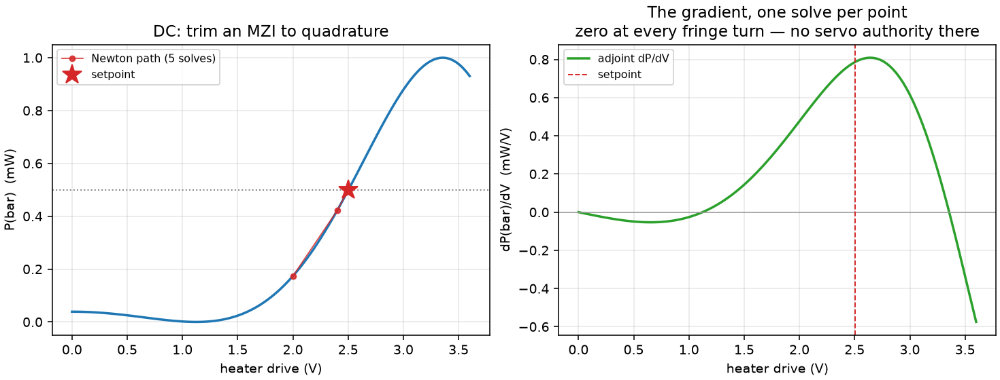
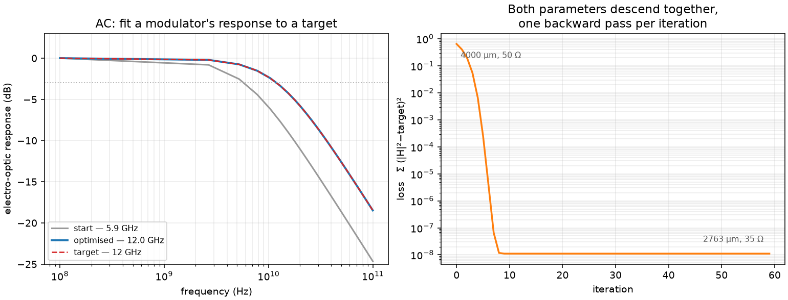
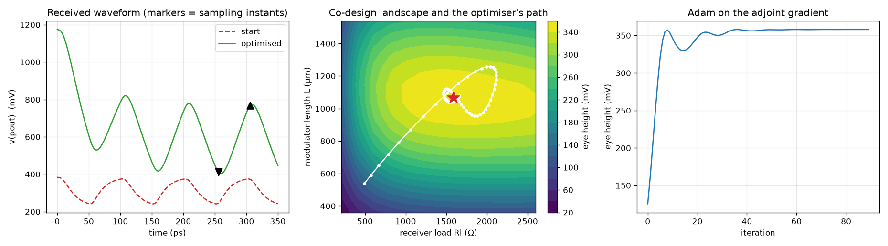
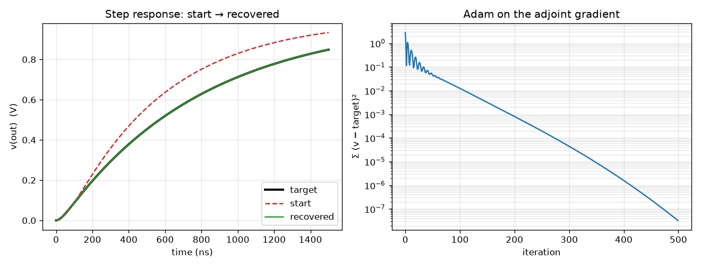

<div align="center">
  <picture>
    <source media="(prefers-color-scheme: dark)" srcset="../../docs/logos/logo_icon_dark.svg">
    <source media="(prefers-color-scheme: light)" srcset="../../docs/logos/logo_icon.svg">
    
  </picture>
</div>

# Optimising a circuit, not just simulating one

Every example here answers the same question — **which way do I move this
design parameter to make the circuit better?** — and gets the answer from
fairchild's adjoint rather than from re-simulating once per parameter.

That distinction is the whole point. Finite differences cost one full
simulation per parameter and then hand you a number contaminated by the
solver's own convergence tolerance. An adjoint costs one extra solve *total*,
regardless of how many parameters you are sweeping, and it differentiates the
residual — an explicit function evaluated to machine precision — rather than
differencing two converged answers. Each example below checks its gradient
against a full re-solve and prints the disagreement, because a gradient you
have not checked is a plausible-looking way to walk downhill to the wrong
place.

## The four

| Example | Analysis | The design question |
|---|---|---|
| [`dc_mzi_bias_trim.py`](dc_mzi_bias_trim.py) | `.op` | Where do I bias this heater to hold an MZI at quadrature? |
| [`ac_modulator_bandwidth.py`](ac_modulator_bandwidth.py) | `.ac` | How long a modulator, driven from what impedance, hits 12 GHz? |
| [`eo_link_codesign.py`](eo_link_codesign.py) | `.tran` | What modulator length and receiver load open the eye widest? |
| [`step_response_match.py`](step_response_match.py) | `.tran` | What R's and C's produced this measured step response? |

The first three are photonic; the last is a plain RC ladder, kept because every
number in it is checkable by hand, which is what you want from the example you
read first when something is not working.

### DC — trim an interferometer to quadrature



An MZI leaves the wafer with an arbitrary phase offset and a heater trims it
back. Because `dP/dV` comes out of the same solve as `P`, a Newton step costs
what an evaluation costs — five solves to land on quadrature to one part in
`10⁶`.

The right-hand panel is the part worth looking at: the gradient is **zero at
every turn of the fringe**. That is real physics, not a numerical artifact, and
it is why a real modulator bias controller has to be brought up on a known
flank. An optimiser started on a peak has no direction to move.

### AC — fit a frequency response to a target



A least-squares fit of `|H(f)|²` against a target passband, over 24 frequency
points, differentiated with respect to modulator arm length and driver
impedance. One backward pass covers the whole sweep — the cost does not grow
with the number of frequencies you are trading off, which is exactly the
property that makes filter design tractable.

It moves a 4000 µm / 50 Ω modulator to 2763 µm / 35 Ω, taking the electro-optic
bandwidth from 5.9 GHz to 12.0 GHz. The trade it found is the real one: the
shorter arm is faster but its `V_π` rises from 3.00 to 4.34 V/arm.

**This example shows the chain rule you will have to write yourself.** The deck
couples `c_j0` to `l_um` through a design rule (capacitance per micron), so the
adjoint's `∂L/∂l_um` — length alone, junction capacitance held fixed — is nearly
zero and is *not* the derivative you want. The total is

```python
d_len = (g_l_ps1 + g_l_ps2) + C_PER_UM * (g_cj_ps1 + g_cj_ps2)
```

The adjoint returns partials with respect to netlist parameters. Composing them
onto your actual design variables is your job, and it is the step where a
gradient most often silently comes out wrong.

### Transient — co-design across the electro-optic boundary



The electrical and optical halves of a link are usually optimised by two people
in two tools. Here modulator length and receiver load are found together, from
one gradient that crosses the domain boundary twice — driver → optics →
detector → load. A longer modulator is more efficient (`V_π ∝ 1/L`) and also
slower (`C_mod ∝ L`); a larger load gives more volts per amp and also more
`R·C`. Both optima are in the interior and neither is visible from one side.

This one uses `jax.grad`, so the chain rule from netlist parameters onto the
design variable — one length that moves `V_π` and `C_mod` together — is composed
for you by the `jax.custom_vjp` adapter rather than written by hand.

### Transient — recover known component values



The plainest possible use of the transient adjoint. Simulate a two-pole RC
ladder at known values to make a target waveform, throw the values away, start
the optimiser somewhere wrong, and require it to find its way back.

Recovering *known* values is deliberate. Any optimiser can make a loss go down;
only a correct gradient walks to the answer that generated the data. A sign
error or a dropped history term in the co-state recursion still descends — just
to somewhere else.

## Running them

```bash
python3 examples/optimization/dc_mzi_bias_trim.py
python3 examples/optimization/ac_modulator_bandwidth.py
python3 examples/optimization/step_response_match.py

# the JAX one brings its own dependency
uv run --with jax python examples/optimization/eo_link_codesign.py
```

Every one takes `--selftest`, which asserts the optimum and the gradient check
and skips plotting. That is the form CI runs them in.

## Which entry point to use

| You want | Call |
|---|---|
| `d(operating point)/dp` | `Circuit.dc_adjoint(probes, wrt)` |
| `d(frequency response)/dp` | `Circuit.ac_adjoint(node)` → `.response`, `.backward(weights, params)` |
| `d(waveform functional)/dp` | `Circuit.tran_adjoint(...)` → `.backward(cotangent, params)` |

All three return partials with respect to **netlist parameters**. If your design
variables are something else — and in photonics they usually are, because
geometry moves several netlist parameters at once — the composition is yours to
write, either by hand (`step_response_match.py`, `ac_modulator_bandwidth.py`) or
by letting JAX do it (`eo_link_codesign.py`).

## Two things that will bite you

**Do not gradient-check at the optimum.** The gradient is zero there, and
agreeing about zero proves nothing — it is the one place a broken adjoint passes
its own test. Check at the start point, where the gradient is large.

**A near-zero partial gets a large relative error bar, and that is correct.**
`backward` warns when a partial's two finite-difference step sizes disagree
relatively. When a partial is individually near zero — as `∂L/∂l_um` is above,
because two much larger phase terms nearly cancel — the bar is large no matter
how small the absolute error is. Check the quantity you actually use, which is
usually a sum, against a re-solve. `ac_modulator_bandwidth.py` does exactly
this, and agrees to `1e-8`.
